# 1. Database schema additions and campaign schema

This document is the single source of truth for the `business_radar` SQLite schema. It settles the
tables that no other document owns — `campaigns`, `campaign_cities`, `campaign_businesses`,
`businesses`, `business_contacts`, `research_runs`, `research_findings`, `sources`,
`finding_sources`, `opportunities`, `opportunity_modules`, `verifications`, `verification_checks`,
`responses`, `users`, `schema_version` — and it arbitrates the places where seven documents written
before it declared overlapping or contradictory DDL. It rules on three questions those documents
left open or answered differently: which `report_exports` definition is real, whether a business
belongs to one campaign or many, and what the canonical column names are for `research_findings`,
`verifications.verdict`, `research_runs.status` and four smaller collisions. It defines the
deterministic identity key that stops "A.B.C. Hospital" and "ABC Hospital, Dhule" becoming two rows
and two emails (§29), the merge procedure that must preserve a suppression when two rows collapse,
the forward-only migration sequence for the whole sixteen-document pack in dependency order, the
seed data the system cannot boot without, and an ER map of every table in the system including the
ones other documents own. Written last, this file is nonetheless foundational: where it contradicts
a table's owning document it is because the owner is wrong, and §1.2 says so explicitly and names
the edit required.

---

## 1.1 Scope, ownership and conventions

### 1.1.1 Who owns which table

A table has exactly one owning document; that document prints its `CREATE TABLE` and every other
document treats it as a contract. This is the index.

| Table / view | Owner | Referenced by |
|---|---|---|
| `schema_version` | **01** (this file) | the migration runner |
| `users` | **01** | every table with an actor column |
| `campaigns` | **01** | 03, 04, 05, 08, 10, 11, 14 |
| `campaign_cities` | **01** | 03, 14 |
| `campaign_businesses` | **01** | 03, 04, 05, 10, 14 |
| `businesses` | **01** | everything |
| `business_contacts` | **01** | 03, 05, 08, 10, 11 |
| `research_runs` | **01** | 03, 05, 06, 10, 11, 14 |
| `research_findings` | **01** | 03, 05, 06, 10, 11, 14 |
| `sources` | **01** | 03, 05, 06, 10, 11, 14 |
| `finding_sources` | **01** | 03, 06, 10, 11 |
| `opportunities` | **01** | 03, 05, 06, 10, 14 |
| `opportunity_modules` | **01** | 03, 05, 06 |
| `verifications` | **01** (see §1.2.5) | 03, 04, 05, 10, 11 |
| `verification_checks` | **01** (see §1.2.5) | 04, 05, 11 |
| `responses` | **01** (see §1.2.5) | 03, 05, 08, 10, 11, 14 |
| `merge_candidates` | **01** | 04 (review queue), 14 (sweep job) |
| `business_merges` | **01** | 11 (audit), 14 |
| `business_status_transitions` | `04-verification-workflow.md` | 01 (trigger target), 11 |
| `verification_reason_codes` | `04-verification-workflow.md` | 01, 03 |
| `contact_policy` | `05-outreach-workflow.md` | 01, 03, 04, 08, 14 |
| `suppressions` | `05-outreach-workflow.md` | 01, 03, 04, 08, 10, 11 |
| `selections` | `05-outreach-workflow.md` | 03, 04, 10 |
| `outreach_drafts` | `05-outreach-workflow.md` | 03, 06, 11 |
| `outreach_messages` | `05-outreach-workflow.md` | 03, 06, 08, 10, 11, 14 |
| `outreach_approvals` | `05-outreach-workflow.md` | 06, 11 |
| `outreach_events` | `05-outreach-workflow.md` | 03, 08, 11 |
| `outreach_status_transitions` | `05-outreach-workflow.md` | 11 |
| `inbound_emails` | `07-email-integration.md` | 14, 16 |
| `draft_findings` | `11-audit-architecture.md` (see §1.2.6) | 06, 11 |
| `whatsapp_optins` | `08-whatsapp-integration.md` | 05, 11 |
| `whatsapp_templates` | `08-whatsapp-integration.md` | 06 |
| `outreach_whatsapp` | `08-whatsapp-integration.md` | 05, 11 |
| `whatsapp_webhook_events` | `08-whatsapp-integration.md` | 14 |
| `whatsapp_delivery_state_map` | `08-whatsapp-integration.md` | 08 only |
| `handoffs` | `10-human-handoff.md` | 03, 04, 05, 11, 14 |
| `audit_actions` | `11-audit-architecture.md` | 01 (seed), every writer |
| `audit_log` | `11-audit-architecture.md` | everything |
| `report_exports` | `11-audit-architecture.md` (see §1.2.1) | 03, 14 |
| `jobs` | `14-background-jobs.md` | 05, 11 |
| `job_runs` | `14-background-jobs.md` | 11 |
| `job_schedules` | `14-background-jobs.md` | 14 only |
| `job_state_transitions` | `14-background-jobs.md` | 14 only |
| `rate_buckets` | `14-background-jobs.md` | 05, 08 |
| `spend_ledger` | `14-background-jobs.md` | 14 |
| `sessions` | `12-security-model.md` | 11, 13 |
| `api_tokens` | `12-security-model.md` | 13 |
| `v_report_business` | `03-html-report.md` | 03 |
| `v_ai_message_audit` | `06-message-engine.md` | 06, 11 |
| `v_funnel_business` | `10-human-handoff.md` | 03, 10 |
| `v_outcome_labels` | `10-human-handoff.md` | 10 |
| `v_spend_today`, `v_jobs_dead`, `v_jobs_queue_depth` | `14-background-jobs.md` | 14 |
| `v_campaign_counters` | **01** (§1.3.5) | 03, 14 |
| `v_business_identity` | **01** (§1.12.7) | 04, 14 |

Three tables are extensions to `_CONTEXT.md` §6's canonical list and are named here for the first
time: `campaign_businesses` (§1.3.4), `merge_candidates` and `business_merges` (§1.12.5). Each is
flagged in Open questions.

Three further extensions to §6 are owned elsewhere and appear in the map because their owners asked
for the row: `inbound_emails` (`07` §7.1.4, requested at `07` §7.16), and `sessions` and `api_tokens`
(`12` §12.4.3 and §12.4.7, requested at `12` §12.15). This document rules their id prefixes in
§1.1.3 and does not print their DDL — the owning document does.

### 1.1.2 Conventions this schema obeys

| Rule | Value |
|---|---|
| Engine | SQLite 3.37+, one file at `data/radar.db` |
| Connection pragmas | `PRAGMA foreign_keys = ON; PRAGMA journal_mode = WAL; PRAGMA busy_timeout = 5000; PRAGMA synchronous = NORMAL;` set by `radar/db.py::connect()` on every connection, and asserted afterwards |
| Primary keys | `TEXT`, `<prefix>_` + 26-char Crockford base32 ULID from `radar/ids.py` |
| Timestamps | `TEXT`, ISO-8601 UTC, `YYYY-MM-DDTHH:MM:SSZ`, default `strftime('%Y-%m-%dT%H:%M:%SZ','now')` |
| Dates | `TEXT`, `YYYY-MM-DD`. Where a date is IST-relative (`day_ist`, `report_date`) the column name says so |
| Booleans | `INTEGER NOT NULL ... CHECK (col IN (0,1))`. No `BOOLEAN`, no `NULL` standing in for false |
| Enums | `CHECK (col IN (...))` on every one, without exception. The state machine is a database constraint, not a Python convention |
| JSON | `TEXT` with `CHECK (json_valid(col))`. `json_extract` appears in maintenance queries only, never in an application hot path |
| Money | `INTEGER`, whole rupees. No `REAL` for money, and no `_micros_inr` column anywhere: §1.2.4 D7 replaced the only one with quota counts, so the money columns that remain are deal values (`est_value_inr`) and not spend |
| Deletes | Almost nothing is deleted. Rows are tombstoned (`deleted_at`, `released_at`, `superseded_at`) so a later question has an answer |
| Portability | Nothing SQLite-only in an application query. `strftime`, `substr` and `json_valid` inside DDL defaults and CHECKs are acceptable; partial indexes are acceptable (Postgres has them); `WITHOUT ROWID` is not used |

Every enum value in this file comes from `_CONTEXT.md` §6. Where a document needed a value §6 does
not list, §1.2.4 or the table's own section records the addition.

### 1.1.3 Id prefixes — the canonical ruling

`_CONTEXT.md` §2 names nine prefixes. Six documents raised the gap in their Open questions (`03` §7,
`05` §2, `06` §3, `08`, `10` §1, `11` §2) and `14` §14.3.6 proposed four; `07` §7.16 asks for `inb_`
and `12` §12.15 for `ses_` and `tok_`. This is the ruling; every literal in the pack must match it.

| Table | Prefix | Source |
|---|---|---|
| `campaigns` | `cmp_` | `_CONTEXT.md` §2 |
| `businesses` | `biz_` | `_CONTEXT.md` §2 |
| `research_runs` | `res_` | `_CONTEXT.md` §2 |
| `sources` | `src_` | `_CONTEXT.md` §2 |
| `verifications` | `ver_` | `_CONTEXT.md` §2 |
| `outreach_messages` | `msg_` | `_CONTEXT.md` §2 |
| `outreach_drafts` | `out_` | `_CONTEXT.md` §2 |
| `responses` | `rsp_` | `_CONTEXT.md` §2 |
| `audit_log` | `aud_` | `_CONTEXT.md` §2 |
| `research_findings` | `fnd_` | ruled here; already used in 06, 11 |
| `opportunities` | `opp_` | ruled here; already used in 03, 11 |
| `verification_checks` | `chk_` | ruled here |
| `business_contacts` | `cnt_` | ruled here; 05 §5.3.9, 08 §8.3.7 |
| `users` | `usr_` | ruled here; used throughout |
| `selections` | `sel_` | ruled here; 05 |
| `outreach_approvals` | `apr_` | ruled here; 05, 06 |
| `outreach_events` | `evt_` | ruled here; 05 |
| `suppressions` | `sup_` | ruled here; 05, 08, 11 |
| `handoffs` | `hnd_` | ruled here; 10 |
| `report_exports` | `rex_` | ruled here; 03, 11 |
| `inbound_emails` | `inb_` | ruled here; 07 §7.1.4, §7.16 |
| `whatsapp_optins` | `opt_` | ruled here; 08 |
| `whatsapp_templates` | `wat_` | ruled here; 08 |
| `outreach_whatsapp` | `waw_` | ruled here; 08 |
| `whatsapp_webhook_events` | `wev_` | ruled here; 08 |
| `jobs` | `job_` | ruled here; 14 |
| `job_runs` | `run_` | ruled here; 14 |
| `job_schedules` | `sch_` | ruled here; 14 |
| `spend_ledger` | `spn_` | ruled here; 14 |
| `sessions` | `ses_` | ruled here; 12 §12.4.3 |
| `api_tokens` | `tok_` | ruled here; 12 §12.4.7 |
| `campaign_businesses` | `cbz_` | ruled here |
| `merge_candidates` | `mgc_` | ruled here |
| `business_merges` | `mrg_` | ruled here |
| `jobs.batch_id` | `bat_` | ruled here; 14 |
| `jobs.trace_id` | `trc_` | ruled here; 14 |
| request context (`audit_log.request_id`) | `req_` | ruled here; 11 |

`campaign_cities`, `finding_sources`, `opportunity_modules`, `draft_findings`,
`business_status_transitions`, `outreach_status_transitions`, `job_state_transitions`,
`verification_reason_codes`, `whatsapp_delivery_state_map`, `rate_buckets`, `contact_policy` and
`schema_version` have natural or composite keys and take no prefix.

```python
# radar/ids.py

_PREFIXES: frozenset[str] = frozenset({
    "cmp", "biz", "res", "src", "ver", "msg", "out", "rsp", "aud", "fnd", "opp", "chk",
    "cnt", "usr", "sel", "apr", "evt", "sup", "hnd", "rex", "inb", "opt", "wat", "waw",
    "wev", "job", "run", "sch", "spn", "ses", "tok", "cbz", "mgc", "mrg", "bat", "trc",
    "req",
})


def new_id(prefix: str) -> str:
    """A sortable, prefixed, greppable primary key.

    Without the prefix a log line reading 'not found: 01JB2K...' does not say which table was
    searched, and a foreign key typed into the wrong column is invisible until it produces a
    silently empty join — which, in a system whose whole job is deciding whether a business may
    be contacted, is the failure that sends a message to the wrong company. The prefix turns
    both into an immediate assertion failure. ULID ordering is the side benefit: ids sort by
    creation time, so `ORDER BY id` is a usable tiebreak when two rows share a timestamp
    truncated to the second.
    """
    if prefix not in _PREFIXES:
        raise ValueError(
            f"unregistered id prefix {prefix!r}; add it to radar/ids.py and 01-data-model.md §1.1.3"
        )
    return f"{prefix}_{_crockford_ulid()}"
```

---

## 1.2 Schema conflicts resolved

Seven documents committed to DDL before this one existed. Six genuine conflicts resulted. Each is
resolved here, with the losing document's required edit stated precisely.

### 1.2.1 Conflict A — `report_exports` is defined three times

**Where.** `03-html-report.md` §3.12.1 (`radar/migrations/022_report_exports.sql`, "This document
owns this table"); `11-audit-architecture.md` §11.11.1 (`radar/migrations/037_report_exports.sql`);
and `14-background-jobs.md` §14.3.5 prints a third column list as a "contract" that matches neither.

**Column-set comparison.**

| Concern | 03 | 11 | 14 contract |
|---|---|---|---|
| file format | `fmt` | **`kind`** | **`kind`** (plus `DAILY_HTML`) |
| what the report covers | **`kind`** (`CAMPAIGN`/`DAILY`/`ADHOC`) | `scope` + `scope_key` | `scope` (a JSON filter blob) |
| file path | `rel_path` | `rel_path` | `path` |
| content hash | `sha256` | `content_sha256` | `sha256` |
| data hash (numbers, template-independent) | — | `data_sha256`, `data_rel_path` | — |
| build lifecycle | — | — | `status`, `error`, `generated_by_job_id` |
| retention | `deleted_at`, `delete_reason` | `retention_class`, `expires_at`, `deleted_at`, `deleted_reason` | `expires_at` |
| DPDP | `include_contacts` | `contains_pii` + `CHECK (contains_pii = 0 OR retention_class <> 'PERMANENT')` | — |
| immutability | none | two triggers | none |
| provenance | `generator_version`, `schema_version` | `template_version`, `generator_version`, `db_schema_version`, `query_fingerprint` | — |
| report-specific | `report_date`, `cities`, `mode`, `app_base_url`, `filters_json`, `row_count` | `title`, `filters_json`, `columns_json`, `row_count` | `filename`, `row_count` |

The three are not merely different, they **collide semantically**: `kind` means the file format in
11 and 14 and means the report's subject in 03. Code written against one and run against the other
writes `'HTML'` into a column checked for `'CAMPAIGN'` — a constraint failure at best, and at worst a
`CHECK` wide enough to accept it and an archive that cannot be filtered.

**Ruling: `11-audit-architecture.md` §11.11.1 wins**, with three amendments.

Reasoning, in order of weight:

1. `_CONTEXT.md` invariant 5 says report numbers come from real rows and are never fabricated. The
   only column set that makes that provable after the fact is 11's, because `data_sha256` hashes the
   aggregate payload with `generated_at` and `generator_version` stripped. 03's single `sha256` over
   the rendered bytes answers "is this the same file", not "were these the numbers the database
   produced". Losing the second hash is losing the only enforcement the invariant has once the
   report has been emailed to somebody.
2. 11 is the only definition with `trg_report_exports_no_delete` and
   `trg_report_exports_identity_immutable`. §42 ("store every campaign; reopen previous campaigns")
   is worth nothing if an archive row can be edited into a different archive row.
3. 11 carries `CHECK (contains_pii = 0 OR retention_class <> 'PERMANENT')`. 03's `include_contacts`
   records the same fact and enforces nothing, and DPDP purpose limitation is not a reporting
   concern that can be left to a convention.
4. Ownership should follow the constraint burden. 11 owns retention, erasure and hashing for the
   whole system; splitting `report_exports` away from that leaves two documents defining retention.

**Amendment 1 (naming; resolves the collision).** Rename 11's `kind` to `fmt`:

```sql
fmt TEXT NOT NULL CHECK (fmt IN ('HTML','CSV','XLSX','PDF','JSON'))
```

`scope` keeps 11's meaning and vocabulary (`CAMPAIGN`, `DAILY`, `CITY`, `INDUSTRY`,
`TOP_OPPORTUNITIES`, `SUBJECT_ACCESS`, `AUDIT`). The name `kind` disappears from this table
entirely, so no reader has to remember which sense is meant. 14's `DAILY_HTML` is expressed as
`fmt='HTML', scope='DAILY'`.

**Amendment 2 (lifecycle; harvested from 14).** `generate_report` inserts the row before the file
exists, so a crashed build is visible rather than invisible. Add:

```sql
status              TEXT NOT NULL DEFAULT 'PENDING'
                      CHECK (status IN ('PENDING','READY','FAILED','PURGED')),
error               TEXT,
generated_by_job_id TEXT REFERENCES jobs(id),
CHECK (status <> 'READY'  OR (bytes > 0 AND length(content_sha256) = 64
                              AND length(data_sha256) = 64 AND row_count IS NOT NULL)),
CHECK (status <> 'FAILED' OR error IS NOT NULL)
```

and relax `bytes`, `content_sha256`, `data_sha256` and `row_count` to nullable, since a `PENDING`
row has no file yet. The `status <> 'READY'` clause is what keeps them honest once the build
finishes: a `READY` row without both hashes is impossible.

**Amendment 3 (report identity; harvested from 03).** Add `report_date TEXT` (the IST date in the
filename, `YYYY-MM-DD`) and `cities TEXT` (JSON array, `campaign_cities.ordinal` order). Both are
what §5's filename is built from and what the archive list is grouped by, and neither is derivable
from `scope_key` for a `CAMPAIGN`-scope export covering four cities. 03's `mode`, `app_base_url` and
`include_contacts` are **not** carried: the first two belong in `filters_json`, and the third is
`contains_pii`.

**What `03-html-report.md` must change.**

1. Delete §3.12.1's `CREATE TABLE report_exports` and its four indexes; replace with "Owned by
   `11-audit-architecture.md` §11.11.1 as amended by `01-data-model.md` §1.2.1."
2. Delete `radar/migrations/022_report_exports.sql` from §3's migration list. The table is created
   by `048_report_exports.sql` (§1.13.2).
3. Rewrite every `report_exports` write to the winning columns: `fmt` for format, `scope` +
   `scope_key` for subject, `content_sha256` (not `sha256`), and a two-phase write —
   `status='PENDING'` before rendering, `UPDATE ... SET status='READY'` with both hashes after
   `os.replace()`.
4. `03` must additionally produce `data_rel_path` and `data_sha256`. It already builds `ReportData`;
   the canonical payload is `canonical_json(asdict(report_data))` with `generated_at`,
   `generated_by` and `generator_version` removed, gzipped to
   `data/reports/<campaign_id>/<filename>.data.json.gz`. Without it the drift note in §3.4.1.3 has
   no historical baseline to compare against.
5. §3.13's endpoints are unchanged. `DELETE /api/v1/report_exports/<rex_id>` sets `deleted_at` and
   `deleted_reason='MANUAL'`, which the winning DDL already permits and its trigger already protects.

**What `14-background-jobs.md` must change.** Delete the commented contract block in §14.3.5 and
point at `11-audit-architecture.md` §11.11.1. The `generate_report`, `export_*` and `daily_report`
job rows keep their behaviour — they were already written against `status`/`error`/
`generated_by_job_id`, which Amendment 2 adopts. Two renames: `path` -> `rel_path`,
`sha256` -> `content_sha256`.

**What `11-audit-architecture.md` must change.** Apply Amendments 1-3. In §11.6's action catalogue,
`REPORT_GENERATED` and `DATA_EXPORTED` list `kind` in `detail_json`; rename to `fmt`. The migration
number moves from `037` to `048` (§1.13.2).

### 1.2.2 Conflict B — does a business belong to one campaign?

**Where.** `03-html-report.md` indexes `businesses(campaign_id, city, industry, category)` and
`v_report_business` reads `b.campaign_id` and joins `campaigns cm ON cm.id = b.campaign_id`.
`04-verification-workflow.md` §4.2.6 states the position outright: *"`businesses` rows are
per-campaign. A second campaign covering Dhule therefore creates a **new** row for the same
real-world clinic."* `05-outreach-workflow.md` §5.4.2 filters the selection grid with
`WHERE b.campaign_id = :campaign_id`. `10-human-handoff.md` §10.9.2 reads `b.campaign_id` and flags
the question in its Open questions item 3.

**What per-campaign rows cost.** `04` names one consequence itself — without a cross-campaign
identity the rejection evaporates — and builds `resolve_prior_verdict()`, `prior_business_id` and
`skip_reason='PRIOR_PERMANENT_REJECTION'` to repair it. But there are five leaks, and that machinery
repairs one:

| Invariant | What per-campaign rows do to it |
|---|---|
| `_CONTEXT.md` §3.3 — opt-out is absolute and permanent | `suppressions.business_id` points at the campaign-A row. The campaign-B row has a different `business_id`, so a `BUSINESS`-scope suppression stops matching. It survives only if the opt-out also happened to be scoped `EMAIL`/`PHONE`/`DOMAIN` **and** the same contact value was rediscovered. That is luck, not a guarantee, and this is the one invariant the system exists to keep. |
| §29 duplicate contact protection | "same business, recent campaign, previous response" is a `business_id` comparison in every gate in `05` §5.9. Two rows means the gate compares a row to itself and passes. |
| §31 max attempts / max follow-ups | Counted per `business_id`. Two rows means two independent attempt budgets for one real business. Three campaigns in a year means nine cold emails to a clinic entitled to three. |
| §32 / §28 outreach history | The confirmation screen for the campaign-B row shows "never contacted" for a business contacted in June. §28 requires the previous contact history on that exact screen. |
| §54 qualified conversations | Every funnel denominator double-counts a rediscovered business, and §53's "which city gives the best opportunities" is computed from those denominators. |

**Ruling: `businesses` is one row per real-world business, globally unique on `business_key`.
Campaign participation moves to a join table, `campaign_businesses`. `businesses` additionally
carries a denormalised, `NOT NULL` `first_seen_campaign_id`.** Both, as §1.4 and §1.3.4 define them.

Why the join table:

- The five leaks close by construction rather than by carry-forward code. A suppression, an attempt
  count, a response history and a funnel row all key on one `business_id` that does not change when
  a second campaign finds the same clinic.
- `businesses.status` — `04`'s ten-state machine — stays exactly where it is, one column on one row,
  and finally means what it claims to mean: "whose move is it on this business". A business rejected
  in August is `REJECTED` in September with no rediscovery branch and no new row.
- The facts that genuinely differ between campaigns — was it in scope, did it clear *this* campaign's
  `min_opportunity_score`, when did *this* campaign first see it, what did *this* campaign's report
  say its city was — are exactly the contents of `campaign_businesses`. They were never properties of
  the business.

Why `first_seen_campaign_id` as well, despite the join table:

- Cohort attribution (`10` §10.9.3, "which campaign produced this client") needs one campaign per
  business, and `10`'s Open question 3 already proposes the tie-break: first campaign wins. Deriving
  it as `MIN(cb.first_seen_at)` on every read puts a correlated subquery on the hottest join in the
  system.
- `11`'s denormalised `audit_log.campaign_id` needs a default campaign for rows written outside a
  campaign context — a manual verification, a suppression created by the inbox poller, a merge.
  `first_seen_campaign_id` is that default.
- It is `NOT NULL` because a business exists only because some campaign discovered it. There is no
  orphan case to design around.
- It is **never** a filter for a campaign report, and §1.3.4 states that as an enforced test.

The cost is that `city`, `industry` and `category` are global rather than per-campaign. That is
correct — a hospital in Dhule is in Dhule regardless of which campaign found it — and the one real
edge case, a business whose city is corrected after campaign A's report was archived, is covered by
`campaign_businesses.city_at_discovery`, which pins what campaign A's report actually said.

**What `03-html-report.md` must change.** Four edits, all mechanical, and none of the twelve queries
moves.

1. `v_report_business` changes its `FROM` clause and two projections:

   ```sql
   -- was:  b.campaign_id,  b.discovered_at, substr(b.discovered_at,1,10) AS discovered_on
   --       FROM businesses b
   --       JOIN campaigns cm ON cm.id = b.campaign_id
   -- now:
       cb.campaign_id,
       cb.first_seen_at                     AS discovered_at,
       substr(cb.first_seen_at, 1, 10)      AS discovered_on,
   -- ...
     FROM campaign_businesses cb
     JOIN businesses b   ON b.id  = cb.business_id
     JOIN campaigns   cm ON cm.id = cb.campaign_id
   ```

   The view now returns **one row per (campaign, business)** rather than one row per business. Every
   downstream query in `03` already filters `WHERE r.campaign_id = :campaign_id`, so all twelve are
   unchanged and all twelve keep returning exactly the businesses that campaign covered. A business
   in two campaigns correctly appears in both reports, with each campaign's own
   `min_opportunity_score` applied to `is_qualified` — which the old model got wrong in the other
   direction by giving it two rows with two independent statuses.

2. `b.discovered_at` is no longer a per-campaign fact. `businesses.first_discovered_at` is global;
   `campaign_businesses.first_seen_at` is per campaign. The view projects the latter under the name
   `discovered_at`, so `03`'s §39 "Date discovered" filter and its `discovered_on` grouping are
   unchanged.

3. Replace the index. `ix_businesses_campaign` becomes two, defined in §1.3.4 and §1.4.5:

   ```sql
   CREATE INDEX ix_cb_campaign_state ON campaign_businesses(campaign_id, state);
   CREATE INDEX ix_businesses_geo    ON businesses(city_slug, industry, category);
   ```

4. §3.4.1.1's definition of "Businesses Found" — "every `businesses` row for the campaign" — becomes
   "every `campaign_businesses` row for the campaign, whatever the business's status". The number is
   identical for a first campaign and correctly includes rediscoveries for a later one.

**What `04-verification-workflow.md` must change.**

1. §4.2.6 is rewritten. There is no new row on rediscovery, so `prior_business_id`,
   `resolve_prior_verdict(conn, business_key, exclude_business_id)` and the
   `skip_reason='PRIOR_PERMANENT_REJECTION'` branch all go. **The table of rediscovery outcomes
   survives verbatim** as a table of *campaign-inclusion* outcomes, written to
   `campaign_businesses.state` and `.exclusion_reason` (§1.3.4) rather than to a new `businesses`
   row. `resolve_prior_verdict` collapses to `SELECT ... FROM verifications WHERE business_id = ?
   AND superseded_at IS NULL`, because the verification is already attached to the row being
   rediscovered. The audit action `REDISCOVERY_RESOLVED` survives and now carries
   `campaign_businesses.id` instead of a new `business_id`.
2. §4.2.7's `ALTER TABLE businesses ADD COLUMN business_key` and `ADD COLUMN prior_business_id` are
   removed: `business_key` is `NOT NULL` with a `UNIQUE` index in the base `CREATE TABLE` (§1.4), and
   `prior_business_id` has no referent. The other nine `ALTER`s (`status_actor_kind`,
   `status_actor_user_id`, `status_changed_at`, `status_verification_id`, `contact_ready_at`,
   `skip_reason`, `research_fingerprint`, `contact_fingerprint`, `website_hash`) are folded into
   §1.4's `CREATE TABLE` instead of being added by `ALTER`, because `businesses` is created by
   migration `003` and `04`'s triggers in migration `012` read those columns.
3. Its three indexes change:

   | 04 declares | Becomes | Why |
   |---|---|---|
   | `CREATE INDEX ix_businesses_key ON businesses(business_key)` | `CREATE UNIQUE INDEX ux_businesses_key ON businesses(business_key)` | The key is now an identity, not a hint. A non-unique index would permit the exact duplicate row this ruling exists to prevent. |
   | `CREATE INDEX ix_businesses_status ON businesses(status, campaign_id)` | `CREATE INDEX ix_businesses_status ON businesses(status)` | `campaign_id` is not on the table. |
   | `CREATE INDEX ix_businesses_queue ON businesses(campaign_id, status) WHERE status='NEEDS_VERIFICATION'` | `CREATE INDEX ix_cb_queue ON campaign_businesses(campaign_id, business_id) WHERE state='INCLUDED'`, used with `ix_businesses_status` | The verification queue is now a join: businesses in this campaign whose status is `NEEDS_VERIFICATION`. |

4. Its four triggers are **unchanged**. `trg_biz_status_transition`,
   `trg_biz_verified_needs_human_checklist`, `trg_biz_contacted_only_from_ready` and
   `trg_biz_status_touch` read only `status`, `status_actor_kind`, `status_actor_user_id`,
   `status_verification_id`, `updated_at` and the `verifications` table — none of which this ruling
   touches. §1.4's `CREATE TABLE` carries every column they read, and a test asserts it (§1.16).
5. §4.1's invariants V1, V2 and V3 are unchanged and gain force: they now apply to one row per real
   business rather than one row per business per campaign.

**What `05-outreach-workflow.md` must change.** One clause. §5.4.2's `SELECTABLE_GRID_SQL`:

```sql
--  FROM businesses b
-- WHERE b.campaign_id = :campaign_id
  FROM campaign_businesses cb
  JOIN businesses b ON b.id = cb.business_id
 WHERE cb.campaign_id = :campaign_id
   AND cb.state = 'INCLUDED'
```

Every gate in §5.9 keys on `business_id` and is unchanged. Gate F1 ("recent campaign") gets
*stronger*, because the prior campaign's messages now hang off the same `business_id`.

**What `10-human-handoff.md` must change.** Exactly what its Open question 3 predicted:
`v_funnel_business` swaps `FROM businesses b` for the two-table join above and takes `campaign_id`
from `cb`. The §10.9.3 cohort rule reads `b.first_seen_campaign_id` and needs no tie-break, because
the column is the tie-break. `10` §10.9.2's own note — "Nothing else in this document changes; every
query below reads only `v_funnel_business`" — holds.

**Test that keeps the ruling true.**

```python
def test_first_seen_campaign_is_never_a_scope_filter():
    """first_seen_campaign_id is for attribution. Never for scoping a campaign view.

    Greps radar/**/*.py and radar/**/*.sql for 'first_seen_campaign_id' within four lines of
    ':campaign_id'. Permitted hits: radar/analytics.py (cohorts) and radar/audit.py (the
    denormalised audit column). Any other hit is a report that will silently omit every
    rediscovered business — the failure is invisible on a first campaign and appears months
    later as a report that is quietly short.
    """
```

### 1.2.3 Conflict C — `research_findings` column names

`06-message-engine.md` Open question 1 states it precisely: `05` reads `f.statement`, `f.dimension`,
`f.confidence_pct`; `10` reads `f.label`, `f.detail`, `f.weight`; `06` assumes `statement` / `kind` /
`confidence` / `confidence_pct`; `03` reads all of `kind`, `dimension`, `label`, `statement`,
`confidence`, `confidence_pct`, `weight`.

**Ruling: `03`'s set, plus `detail`.** It is a strict superset of the other three, so no document
renames anything; `10` gains `detail`, which nothing contradicts. The four text columns carry a real
distinction:

| Column | Holds | SAMPLE |
|---|---|---|
| `dimension` | which axis of the assessment the finding belongs to | `OPERATIONS` |
| `label` | a <=80-char heading for a report row and a Telegram digest line | `Multi-department outpatient load` |
| `statement` | the full sentence a message may cite. **The canonical claim text** | `The hospital lists six departments and an outpatient department across two floors.` |
| `detail` | optional longer note, never citable by a message, rendered in the expandable panel | `Departments listed: medicine, surgery, orthopaedics, paediatrics, pathology, radiology.` |

`06`'s `BINDING_SQL` selects `f.statement` — unchanged. `10`'s handoff payload selects `f.label`,
`f.detail`, `f.weight` — unchanged. `05` §5.7's research summary selects `f.statement`,
`f.dimension`, `f.confidence_pct` — unchanged.

### 1.2.4 Conflict D — nine smaller name and value collisions

| # | Collision | Ruling | Loser's edit |
|---|---|---|---|
| D1 | `research_runs.status = 'COMPLETE'` (03, 04, 06, 14) vs `'COMPLETED'` (10 §10.9.1, §10.9.2) | **`COMPLETE`** — four documents to one, and it is the literal `04`'s transitions T01 and T23 test | `10`: one occurrence in `v_funnel_business`, one in the §10.9.1 stage table |
| D2 | `verifications.verdict` (03, 04, 05) vs `verifications.result` (10 §10.9.2) | **`verdict`** — `04` owns the verification workflow and uses `verdict` in every invariant | `10`: one occurrence in `v_funnel_business` |
| D3 | `opportunity_modules.ordinal` (03) vs "ordered by rank" (06 §6.8.4) | **`ordinal`** — matches `campaign_cities.ordinal` and `verification_checks.ordinal` | `06`: one docstring line in `resolve_modules()` |
| D4 | `sources.checked_at` (03, 06, 10) vs `sources.fetched_at` (11 §11.9.2) | **`checked_at`** — spec §14 says "Date Checked" and three documents use it | `11`: two occurrences in the Band 1 query (`SELECT` list, `ORDER BY`). The `fetched_at` key inside the `SOURCE_FETCHED` audit payload is a JSON key, not a column, and stays |
| D5 | `responses.body_excerpt` (03) vs `responses.excerpt` (05 OQ4) | **`body_excerpt`** — pairs with `body_text`, and `03` is a printed query rather than an open-question list | `05`: one entry in its Open question 4 |
| D6 | `handoffs.realised_value_inr` (03 §3.3.1) vs `handoffs.won_value_inr` (10 §10.9.2, the owner) | **`won_value_inr`** — `10` owns `handoffs` and prints the DDL | `03`: one entry in its §3.3.1 dependency table |
| D7 | `research_runs.cost_micros_inr` and `campaigns.paused_reason = 'SPEND_CEILING'` (this file, `13`) vs a quota model with no money in it (`_CONTEXT.md` §2, `14` §14.3.5 and §14.7.1, `02` §2.16) | **Quota, not money.** The Gemini free tier bills nothing; the scarce resource is the request and the only ceiling is a 429. §1.6.1 now carries `quota_requests` and §1.3.1's CHECK reads `QUOTA_CEILING` | `13`: `SPEND_CEILING` in §13.4's create-campaign error table, in §13.5.1's research error table and in the §13.22 OpenAPI `paused_reason` enum all become `QUOTA_CEILING`; `12` §12.9's one reference likewise. `14` has already made its half of the change |
| D8 | `research_runs.trigger` (this file) vs `research_runs.reason` (`02` §2.3.2) | **`reason`**, with `02`'s values `('CAMPAIGN','STALE','MANUAL','RECHECK')` — `02` owns `radar/research.py` and writes the column, and `trigger` is a SQL keyword that reads badly in a file that also contains `CREATE TRIGGER` | `13`: one occurrence, §13.4.2's `research_runs.trigger='MANUAL'` becomes `research_runs.reason='MANUAL'`. `02` changes nothing |
| D9 | `model_id` sample literals `'claude-opus-5'` / `'claude-haiku-4-5-20251001'` (this file, `03`, `05`, `08`, `10`, `11`, `13`) vs `_CONTEXT.md` §2's `gemini-2.5-flash` | **`gemini-2.5-flash`** everywhere the sample is a value the code could actually write. `_CONTEXT.md` §2: there is no `anthropic` dependency anywhere in this build, so an Anthropic model id in a live row is a value nothing can produce | Fixed here in §1.6.1 and §1.9.1. `03` §3.4.6, `05` §5.3.4/§5.10.2/§5.15.2/§5.20.2, `08` §8.8.5/§8.9.6, `10` §10.2.2/§10.5.4/§10.7.1, `11` §11.6.9/§11.7.2/§11.8.3/§11.8.4/§11.8.6/§11.9.2 and `13` §13.4/§13.4.2/§13.9 each replace the literal. The "this used to be" notes in `02` §2.1, `06` §6.12.4 and `09` §9.1 are history and stay as they are |

### 1.2.5 Not a conflict: `04` and `10` claim tables they do not define

`04-verification-workflow.md` claims `verifications`, `verification_checks` and
`verification_reason_codes`, and states "Where it prints DDL for a table it owns, that DDL is the
definition and `01-data-model.md` must match it byte-for-byte." `04` prints DDL for
`business_status_transitions` and for its `ALTER TABLE businesses` columns, and for nothing else.

**Ruling.** `01` defines `verifications` and `verification_checks` (§1.8), built to carry every
column `04` reads: `state`, `verdict`, `superseded_at`, `superseded_reason`, `checks_passed`,
`checks_failed`, `mode`, `reason_code`, `verified_at`, `dwell_ms`, `dwell_required_ms`, `why_note`,
`prior_verification_id`, `trigger_reason`, plus `03`'s `verified_by` and `note` and `05`'s
`check_key`, `passed`, `note`, `ordinal`. `04` keeps `verification_reason_codes`, a taxonomy this
document has no opinion about, and keeps its byte-for-byte rule for `business_status_transitions`.
If `04` later prints `verifications` DDL that differs from §1.8, §1.8 wins and `04`'s ownership
paragraph drops the two table names.

The same for `responses`: `10-human-handoff.md` assigns it to `09-response-classification.md`, which
does not exist. §1.9 defines it as a superset of every column `03`, `05`, `08`, `10`, `11` and `14`
read. Doc 09, when written, owns the classifier, the prompt and the confidence calibration — not the
table.

### 1.2.6 Not a conflict: `draft_findings`

Verified by grep: `draft_findings` is defined once, in `11-audit-architecture.md` §11.8.2
(`035_draft_findings.sql`), and `06-message-engine.md` never mentions it. `06` owns
`v_ai_message_audit` (§6.12.1, inside `018_message_engine.sql`) and the
`outreach_drafts.facts_used` / `.inferences_used` JSON arrays that `draft_findings` indexes. No
conflict; §1.1.1 records the ownership.

---
## 1.3 Campaign schema (§1, §2, §36, §42)

Deliverable 2 of §56. A campaign is the unit of work, the unit of reporting and the unit of archive.
Three tables: the campaign, its cities, and its membership.

### 1.3.1 `campaigns`

Every field §2 enumerates, plus the lifecycle `14-background-jobs.md` §14.8.1 drives.

```sql
-- radar/migrations/002_campaigns.sql
CREATE TABLE campaigns (
    id                    TEXT PRIMARY KEY,              -- cmp_...
    name                  TEXT NOT NULL,                 -- 'Dhule-Shirpur-Nashik-Jalgaon - 26 Aug 2026'
    slug                  TEXT NOT NULL,                 -- 'dhule-shirpur-nashik-jalgaon-2026-08-26'

    -- §2: created by / created date-time
    created_by            TEXT NOT NULL REFERENCES users(id),
    created_at            TEXT NOT NULL
                            DEFAULT (strftime('%Y-%m-%dT%H:%M:%SZ','now')),

    -- §1 filters. Cities are rows (campaign_cities); the rest are stored here.
    industries            TEXT NOT NULL DEFAULT '[]',    -- JSON array of the §6 industry enum; [] = ALL
    categories            TEXT NOT NULL DEFAULT '[]',    -- JSON array of the §6 category enum; [] = ALL
    size_filter           TEXT NOT NULL DEFAULT '[]',    -- JSON array of size_band; [] = no size filter
    min_opportunity_score INTEGER NOT NULL DEFAULT 0
                            CHECK (min_opportunity_score BETWEEN 0 AND 100),
    research_depth        TEXT NOT NULL DEFAULT 'STANDARD'
                            CHECK (research_depth IN ('STANDARD','DEEP')),
    max_businesses        INTEGER CHECK (max_businesses IS NULL OR max_businesses > 0),

    -- §2 search status + 14-background-jobs.md §14.8.1
    status                TEXT NOT NULL DEFAULT 'DRAFT'
                            CHECK (status IN ('DRAFT','QUEUED','DISCOVERING','RESEARCHING',
                                              'REPORTING','COMPLETE','PAUSED','FAILED','CANCELLED')),
    paused_reason         TEXT
                            CHECK (paused_reason IS NULL OR paused_reason IN
                                   ('QUOTA_CEILING','MANUAL','PROVIDER_ERROR','RATE_LIMIT')),
    started_at            TEXT,
    finished_at           TEXT,
    cancel_requested      INTEGER NOT NULL DEFAULT 0 CHECK (cancel_requested IN (0,1)),

    -- §2 counters. Progress only. Never rendered as a fact; see §1.3.5.
    n_discovered          INTEGER NOT NULL DEFAULT 0 CHECK (n_discovered >= 0),
    n_researched          INTEGER NOT NULL DEFAULT 0 CHECK (n_researched >= 0),
    n_qualified           INTEGER NOT NULL DEFAULT 0 CHECK (n_qualified  >= 0),
    n_skipped             INTEGER NOT NULL DEFAULT 0 CHECK (n_skipped    >= 0),
    n_verified            INTEGER NOT NULL DEFAULT 0 CHECK (n_verified   >= 0),
    n_contacted           INTEGER NOT NULL DEFAULT 0 CHECK (n_contacted  >= 0),
    counters_reconciled_at TEXT,

    -- provenance of the run itself, so two campaigns are comparable (§53)
    discovery_provider    TEXT,                          -- 'SEARCH_API' | 'MANUAL_IMPORT'
    research_model_id     TEXT,                          -- pinned at start; _CONTEXT.md §2
    research_prompt_version TEXT,
    notes                 TEXT,

    updated_at            TEXT NOT NULL
                            DEFAULT (strftime('%Y-%m-%dT%H:%M:%SZ','now')),

    CHECK (json_valid(industries) AND json_valid(categories) AND json_valid(size_filter)),
    CHECK (status <> 'PAUSED' OR paused_reason IS NOT NULL),
    CHECK (finished_at IS NULL OR started_at IS NOT NULL),
    CHECK (created_at LIKE '____-__-__T__:__:__Z')
);

CREATE UNIQUE INDEX ux_campaigns_slug ON campaigns(slug);
CREATE INDEX ix_campaigns_status  ON campaigns(status, created_at DESC);
CREATE INDEX ix_campaigns_created ON campaigns(created_at DESC);
CREATE INDEX ix_campaigns_live    ON campaigns(id)
    WHERE status IN ('QUEUED','DISCOVERING','RESEARCHING','REPORTING','PAUSED');
```

| Index | Query it serves |
|---|---|
| `ux_campaigns_slug` | Filename collision check in `03` §3.2.8; two campaigns on one day for one city set must not produce one filename |
| `ix_campaigns_status` | `/campaigns` list page, newest first, and the §36 dashboard's live-campaign panel |
| `ix_campaigns_created` | §43 daily report: campaigns created on a given date |
| `ix_campaigns_live` | `14` §14.8.7's `campaign_finalize` tick and the nightly counter reconciliation; both scan only live campaigns and the partial index makes that scan proportional to live work rather than to history |

Notes on specific columns:

- **`industries` / `categories` / `size_filter` are JSON arrays, not join tables.** They are filter
  criteria, written once at campaign creation and never queried across campaigns. A join table would
  be three more tables for a value that is only ever read whole, by one campaign, to be handed to
  discovery as a Python list. The `CHECK (json_valid(...))` keeps them parseable. `[]` means "no
  filter" rather than "no industries" — §1 says the filter is optional, and an empty array is the
  natural encoding of "All".
- **`min_opportunity_score` defaults to 0, not 70.** §1 gives 70 as an example, not a default. A
  campaign that silently drops every business under 70 because nobody typed a number is a campaign
  whose report is missing rows for a reason nobody remembers.
- **`research_model_id` and `research_prompt_version` are pinned at campaign start**, per
  `_CONTEXT.md` §2 and `14` §14.10.4's rule that a quota ceiling pauses rather than degrades. Two
  campaigns run against different models are not comparable, and §53's entire question is a
  comparison.
- **`paused_reason` is `QUOTA_CEILING`, not `SPEND_CEILING`.** `_CONTEXT.md` §2 replaced every
  rupee budget with a quota budget: on the free tier there is no bill to cap, only a
  requests-per-day ceiling that returns 429, and hitting it pauses research until the quota day
  rolls over. `14` §14.7.1 already names the condition `QUOTA_CEILING`; §1.2.4 D7 records the
  ruling and the edits `13` and `12` owe.
- **`cancel_requested`** is the flag `14` §14.8.1's `POST /api/v1/campaigns/<id>/cancel` sets; the
  worker reads it rather than being killed.

### 1.3.2 `campaign_cities` (§1, §3)

```sql
-- radar/migrations/002_campaigns.sql (continued)
CREATE TABLE campaign_cities (
    campaign_id  TEXT NOT NULL REFERENCES campaigns(id) ON DELETE CASCADE,
    city         TEXT NOT NULL,                 -- display form: 'Dhule'
    city_slug    TEXT NOT NULL,                 -- identity form: 'dhule'
    state_region TEXT NOT NULL DEFAULT 'Maharashtra',
    ordinal      INTEGER NOT NULL CHECK (ordinal >= 0),
    status       TEXT NOT NULL DEFAULT 'PENDING'
                   CHECK (status IN ('PENDING','DISCOVERING','COMPLETE','FAILED','SKIPPED')),
    n_discovered INTEGER NOT NULL DEFAULT 0 CHECK (n_discovered >= 0),
    error        TEXT,
    started_at   TEXT,
    finished_at  TEXT,
    PRIMARY KEY (campaign_id, city_slug)
);

CREATE INDEX ix_campaign_cities_order ON campaign_cities(campaign_id, ordinal);
```

| Index | Query it serves |
|---|---|
| `ix_campaign_cities_order` | `03` Q1's `group_concat(cc.city, ', ')` for the header and the filename, and §3's city-tab ordering. City order is Sagar's typed order, not alphabetical, because that is the order he thinks about them in |

`city_slug` is the identity; `city` is the label. `14` §14.8.2's `discover_city` dedupe key is
`discover_city:{campaign_id}:{city_slug}:{cursor_page}`, and the primary key here is what makes that
key unique. Per-city `status` exists because `14` §14.8.7 is explicit that partial failure is not
campaign failure: three cities complete and one fails produces a `COMPLETE` campaign with a
`FAILED` city, and the report says so.

### 1.3.3 The city vocabulary

Cities are free text, not an enum. Sagar will add a city the day he decides to; an enum would make
that a migration. The `city_slug` normaliser is the discipline instead:

```python
# radar/identity.py

def city_slug(city: str) -> str:
    """'Dhule' / ' dhule ' / 'DHULE' / 'Dhule, Maharashtra' -> 'dhule'.

    NFKC, casefold, strip a trailing ', <state>' or ' (<state>)', drop everything that is not
    [a-z0-9], collapse to single hyphens. Without this, a campaign typed as 'Dhule ' and a
    business discovered as 'dhule' never join, and the city tab in the report is empty for a
    city that has forty rows in it.
    """
```

`businesses.city` stores the display form and `businesses.city_slug` the identity form; every join
and filter uses the slug. A `CHECK` cannot enforce that relationship in SQLite, so a test does
(§1.16).

### 1.3.4 `campaign_businesses` — the membership join

The table §1.2.2 rules into existence. One row per (campaign, business) pair: what this campaign
found, what it decided about it, and what it reported.

```sql
-- radar/migrations/004_campaign_businesses.sql
CREATE TABLE campaign_businesses (
    id                  TEXT PRIMARY KEY,               -- cbz_...
    campaign_id         TEXT NOT NULL REFERENCES campaigns(id)  ON DELETE CASCADE,
    business_id         TEXT NOT NULL REFERENCES businesses(id) ON DELETE CASCADE,

    -- membership
    state               TEXT NOT NULL DEFAULT 'INCLUDED'
                          CHECK (state IN ('INCLUDED','EXCLUDED')),
    exclusion_reason    TEXT
                          CHECK (exclusion_reason IS NULL OR exclusion_reason IN
                                 ('BELOW_MIN_SCORE','SIZE_FILTER','CITY_FILTER','INDUSTRY_FILTER',
                                  'CATEGORY_FILTER','RESEARCH_FAILED','PRIOR_PERMANENT_REJECTION',
                                  'PRIOR_REJECTION_COOLING_OFF','LIVE_SUPPRESSION','CAMPAIGN_CAP',
                                  'MANUAL')),
    exclusion_detail    TEXT,                           -- JSON: e.g. {"cool_off_until":"2027-02-01"}

    -- discovery provenance for THIS campaign
    first_seen_at       TEXT NOT NULL
                          DEFAULT (strftime('%Y-%m-%dT%H:%M:%SZ','now')),
    is_rediscovery      INTEGER NOT NULL DEFAULT 0 CHECK (is_rediscovery IN (0,1)),
    discovery_source    TEXT,                           -- 'SEARCH_API' | 'MANUAL_IMPORT' | 'MERGE'
    discovery_source_id TEXT REFERENCES sources(id),
    discovery_rank      INTEGER,                        -- position in the provider's result page

    -- what THIS campaign's report said, pinned so an archived report stays reproducible
    city_at_discovery      TEXT NOT NULL,
    industry_at_discovery  TEXT NOT NULL,
    category_at_discovery  TEXT NOT NULL,
    score_at_close         INTEGER
                             CHECK (score_at_close IS NULL OR score_at_close BETWEEN 0 AND 100),
    status_at_close        TEXT,                        -- businesses.status when the campaign closed
    closed_at              TEXT,

    -- research attribution: which run in this campaign produced the current opportunity
    research_run_id     TEXT REFERENCES research_runs(id),

    created_at          TEXT NOT NULL
                          DEFAULT (strftime('%Y-%m-%dT%H:%M:%SZ','now')),

    CHECK (state <> 'EXCLUDED' OR exclusion_reason IS NOT NULL),
    CHECK (state <> 'INCLUDED' OR exclusion_reason IS NULL),
    CHECK (exclusion_detail IS NULL OR json_valid(exclusion_detail))
);

CREATE UNIQUE INDEX ux_cb_pair          ON campaign_businesses(campaign_id, business_id);
CREATE INDEX ix_cb_campaign_state       ON campaign_businesses(campaign_id, state);
CREATE INDEX ix_cb_business             ON campaign_businesses(business_id, first_seen_at);
CREATE INDEX ix_cb_queue                ON campaign_businesses(campaign_id, business_id)
    WHERE state = 'INCLUDED';
CREATE INDEX ix_cb_campaign_city        ON campaign_businesses(campaign_id, city_at_discovery,
                                                               industry_at_discovery);
```

| Index | Query it serves |
|---|---|
| `ux_cb_pair` | The membership upsert. `INSERT ... ON CONFLICT (campaign_id, business_id) DO NOTHING` is what makes `14` §14.8.2's page re-run idempotent |
| `ix_cb_campaign_state` | `v_report_business`'s driving scan and `03` Q1's `h_found`; replaces `03`'s `ix_businesses_campaign` |
| `ix_cb_business` | "which campaigns have seen this business", the §32 history panel header, and the §29 recent-campaign gate |
| `ix_cb_queue` | `04`'s verification queue, joined to `ix_businesses_status`; replaces `ix_businesses_queue` |
| `ix_cb_campaign_city` | §3/§4's city -> industry -> category tree build, and the §37 city comparison |

**`state` and `exclusion_reason` absorb `04` §4.2.6.** The rediscovery table in `04` maps directly:

| `04`'s rediscovery outcome | `campaign_businesses` row | `businesses.status` |
|---|---|---|
| Prior `REJECTED`, `is_permanent = 1` | `EXCLUDED`, `PRIOR_PERMANENT_REJECTION` | unchanged (`REJECTED`) |
| Prior `REJECTED`, non-permanent, inside cool-off | `EXCLUDED`, `PRIOR_REJECTION_COOLING_OFF`, `exclusion_detail = {"cool_off_until": ...}` | unchanged (`REJECTED`) |
| Prior `REJECTED`, non-permanent, past cool-off | `INCLUDED` | unchanged until a human reopens it (T29) |
| Prior `SKIPPED` | `INCLUDED` | `SKIPPED` -> `AI_RESEARCHED` if re-research is queued (T22) |
| Prior `VERIFIED`, stale | `INCLUDED` | `VERIFIED` -> `NEEDS_VERIFICATION` (T10) |
| Prior `VERIFIED`, live, fingerprint identical | `INCLUDED` | unchanged; carry-forward applies |
| Live suppression on the business or a contact | `EXCLUDED`, `LIVE_SUPPRESSION` | unchanged |
| Never seen before | `INCLUDED`, `is_rediscovery = 0` | new row, `AI_RESEARCHED` |

The important difference from `04`'s original: **`businesses.status` is not rewritten by
rediscovery**, so a rejection cannot evaporate and a verification cannot be silently reset by a
campaign the operator did not think of as touching that business.

**Excluded rows are kept, not skipped.** An `EXCLUDED` row costs one row and buys the report the
sentence "excluded: you rejected this in June", which is the difference between a report Sagar
trusts and one where businesses vanish without explanation. `v_report_business` includes both states
and `03`'s filters can hide `EXCLUDED`; the counts in §1.3.5 are explicit about which state they
count.

**A business is never researched because it is `EXCLUDED`.** `14` §14.8.2 enqueues
`research_business` only for `INCLUDED` rows, which is what stops the system spending Gemini
free-tier quota on a business it may never contact — `04` §4.2.6's argument, preserved.

### 1.3.5 Counters or views? Both, with a rule

§2 stores six counters on the campaign. §8 says "These numbers must come from actual database
results. Never fabricate them." `14` §14.8.1 increments the counters in the same transaction as the
row that causes the increment. `03` §3.4.1.3 reads them **only** to detect drift and renders the
live aggregate. Those four positions are consistent, and this is the ruling that pins them together.

**Ruling.**

1. The six counters exist on `campaigns` as §2 requires, and are maintained by in-transaction
   increment as `14` describes.
2. **No rendering path reads a counter.** Every number a human sees — report header, KPI cards, city
   cards, the §36 dashboard, the §37/§38 comparisons — comes from a SQL aggregate over
   `v_report_business` or `v_campaign_counters`.
3. The counters serve exactly two purposes: an O(1) progress poll while a campaign is running
   (`14` §14.11 — a progress bar that ticks must not run six `COUNT(*)`s per poll), and a drift
   signal (`03` §3.4.1.3 — the mismatch is printed, the aggregate is rendered, and nothing is
   silently repaired from a read path).
4. `v_campaign_counters` is the single definition of what each counter *should* be.
   `campaign_finalize` reconciles from it once at campaign end, and `staleness_sweep` reconciles
   nightly for live campaigns and logs `WARNING` on any mismatch (`14` §14.8.20).

Why not counters alone: a counter is a cache of an aggregate maintained by six write paths, and
§8's instruction is a direct order not to trust one. Why not views alone: `14` §14.11 polls progress
every two seconds for a campaign that may hold 5,000 businesses, and six aggregates per poll over a
join of five tables is the one query in this system that would actually be slow. The split gives
each its correct job — the counter is a progress hint, the view is the truth — and makes the
disagreement between them visible instead of arbitrary.

```sql
-- radar/migrations/050_v_campaign_counters.sql
-- The definition of the six §2 counters. campaign_finalize and staleness_sweep reconcile
-- campaigns.n_* from this view; the report renders from v_report_business, which agrees with it
-- by construction because both count campaign_businesses rows.
DROP VIEW IF EXISTS v_campaign_counters;
CREATE VIEW v_campaign_counters AS
SELECT
    cb.campaign_id,

    -- Everything this campaign discovered, including rediscoveries and excluded rows.
    COUNT(*)                                                        AS n_discovered,

    -- Research completed at least once for the business, in any campaign. Research is a
    -- property of the business, not of the campaign that paid for it; a rediscovered business
    -- with live research is 'researched' for this campaign too, and re-researching it would be
    -- spending Gemini free-tier quota to learn what is already stored.
    SUM(CASE WHEN EXISTS (SELECT 1 FROM research_runs r
                           WHERE r.business_id = cb.business_id
                             AND r.status = 'COMPLETE')
             THEN 1 ELSE 0 END)                                     AS n_researched,

    -- Qualified: the single definition, identical to v_report_business.is_qualified.
    SUM(CASE WHEN cb.state = 'INCLUDED'
              AND o.score IS NOT NULL
              AND o.score >= c.min_opportunity_score
              AND b.status NOT IN ('SKIPPED','REJECTED')
              AND EXISTS (SELECT 1 FROM research_runs r
                           WHERE r.business_id = cb.business_id AND r.status = 'COMPLETE')
             THEN 1 ELSE 0 END)                                     AS n_qualified,

    -- Skipped: excluded by this campaign's filters, or parked/rejected globally.
    SUM(CASE WHEN cb.state = 'EXCLUDED'
               OR b.status IN ('SKIPPED','REJECTED')
             THEN 1 ELSE 0 END)                                     AS n_skipped,

    SUM(CASE WHEN EXISTS (SELECT 1 FROM verifications v
                           WHERE v.business_id   = cb.business_id
                             AND v.verdict       = 'VERIFIED'
                             AND v.state         = 'SUBMITTED'
                             AND v.superseded_at IS NULL)
             THEN 1 ELSE 0 END)                                     AS n_verified,

    -- Contacted attributes to the campaign that sent the message, not to every campaign that
    -- saw the business. outreach_messages.campaign_id is the sending campaign (05 §5.3.5).
    SUM(CASE WHEN EXISTS (SELECT 1 FROM outreach_messages m
                           WHERE m.business_id = cb.business_id
                             AND m.campaign_id = cb.campaign_id
                             AND m.status IN ('SENT','DELIVERED','BOUNCED'))
             THEN 1 ELSE 0 END)                                     AS n_contacted
FROM campaign_businesses cb
JOIN businesses   b ON b.id  = cb.business_id
JOIN campaigns    c ON c.id  = cb.campaign_id
LEFT JOIN opportunities o ON o.business_id = cb.business_id AND o.is_current = 1
GROUP BY cb.campaign_id;
```

**The update path, and its race.**

```python
# radar/campaigns.py

_COUNTERS = ("n_discovered", "n_researched", "n_qualified",
             "n_skipped", "n_verified", "n_contacted")


def bump(conn: sqlite3.Connection, campaign_id: str, counter: str, delta: int = 1) -> None:
    """Increment one campaign counter inside the caller's transaction.

    MUST be called inside the same BEGIN IMMEDIATE transaction as the write that justifies it.
    Called afterwards, in its own transaction, it produces the one drift the nightly sweep
    cannot distinguish from a genuine data change: a crash between the two commits leaves a
    counter permanently one behind, and a progress bar that never reaches 100% is how an
    operator learns to ignore progress bars.
    """
    if counter not in _COUNTERS:
        raise ValueError(counter)
    conn.execute(
        f"UPDATE campaigns SET {counter} = {counter} + ?, "
        f"updated_at = strftime('%Y-%m-%dT%H:%M:%SZ','now') WHERE id = ?",
        (delta, campaign_id),
    )


def reconcile(conn: sqlite3.Connection, campaign_id: str) -> dict[str, tuple[int, int]]:
    """Rewrite all six counters from v_campaign_counters. Returns {counter: (was, now)} for
    every one that moved, so the caller can log it at WARNING rather than repair silently."""
```

The races, named:

| Race | Why it does not corrupt the counter | What it costs |
|---|---|---|
| Two workers finish research for two businesses in the same campaign simultaneously | SQLite has one writer. Both open `BEGIN IMMEDIATE`; the second blocks on the write lock, then applies `n = n + 1` to the committed value. `UPDATE ... SET n = n + 1` is read-modify-write **inside** the write transaction, never a Python-side `n + 1` | Nothing. This is why the increment is SQL, not Python |
| A worker commits the `research_runs` row, then crashes before `bump()` | Impossible if `bump()` is in the same transaction, which is the docstring's rule | If violated: permanent -1 drift, caught by the nightly sweep as a `WARNING` |
| A job is retried after a partial commit | Job handlers are idempotent (`14` §14.5); the `INSERT ... ON CONFLICT DO NOTHING` on `campaign_businesses` returns `changes() = 0` and `bump()` is skipped | Nothing |
| A business is skipped, then unskipped (T22/T23) | `n_skipped` was incremented and is not decremented by the unskip path | Overcount until reconciliation. Deliberate: writing decrements into six paths doubles the surface for the previous bug |
| A business is rediscovered by campaign B | B's `n_discovered` increments; A's does not change | Correct. "Businesses Found" is per campaign, and the rediscovery genuinely is one of B's findings |
| Someone edits the database by hand | Nothing protects a counter from that | The sweep prints both numbers and the report renders the aggregate |

The rule this all serves, stated once for the pack:

> `campaigns.n_*` is a progress hint. `v_campaign_counters` and `v_report_business` are the numbers.
> No template, no API response body and no export ever reads `campaigns.n_*` except to print a drift
> warning beside the aggregate.

```python
def test_no_template_reads_a_campaign_counter():
    """Greps radar/web/templates/**/*.html and radar/report.py for 'n_discovered', 'n_researched',
    'n_qualified', 'n_skipped', 'n_verified', 'n_contacted'. The only permitted hits are inside
    the drift-warning block in the report footer. Spec §8 is a direct instruction; this is its
    only mechanical enforcement."""
```

---
## 1.4 `businesses` (§9, §11, §17, §29)

One row per real-world business, for the life of the database. The `status` column is
`04-verification-workflow.md`'s ten-state machine and is written by exactly one function,
`radar/verify.py::set_status()`.

### 1.4.1 DDL

```sql
-- radar/migrations/003_businesses.sql
CREATE TABLE businesses (
    id                     TEXT PRIMARY KEY,             -- biz_...

    -- IDENTITY (§29). See §1.12 for how business_key is computed and enforced.
    business_key           TEXT NOT NULL,
    name                   TEXT NOT NULL,                -- as discovered, display form
    name_norm              TEXT NOT NULL,                -- §1.12.2 normaliser output
    legal_name             TEXT,                         -- if a registry gave a different one
    aliases                TEXT NOT NULL DEFAULT '[]',   -- JSON array of other observed names

    -- PLACE (§3)
    city                   TEXT NOT NULL,                -- display: 'Dhule'
    city_slug              TEXT NOT NULL,                -- identity: 'dhule'
    state_region           TEXT NOT NULL DEFAULT 'Maharashtra',
    address                TEXT,
    pincode                TEXT CHECK (pincode IS NULL OR pincode GLOB '[0-9][0-9][0-9][0-9][0-9][0-9]'),
    latitude               REAL CHECK (latitude  IS NULL OR latitude  BETWEEN -90  AND 90),
    longitude              REAL CHECK (longitude IS NULL OR longitude BETWEEN -180 AND 180),

    -- CLASSIFICATION (_CONTEXT.md §6)
    industry               TEXT NOT NULL DEFAULT 'OTHER'
                             CHECK (industry IN ('HEALTHCARE','EDUCATION','AUTOMOBILE',
                                    'MANUFACTURING','RETAIL','HOSPITALITY','DISTRIBUTION',
                                    'REAL_ESTATE','PROFESSIONAL_SERVICES','OTHER')),
    category               TEXT NOT NULL DEFAULT 'OTHER'
                             CHECK (category IN ('HOSPITAL','DIAGNOSTIC_CENTER','SCHOOL','COLLEGE',
                                    'MANUFACTURER','DISTRIBUTOR','VEHICLE_DEALER','GARAGE','HOTEL',
                                    'RESTAURANT','BAKERY','RETAIL_STORE','REAL_ESTATE_AGENCY','OTHER')),
    size_band              TEXT NOT NULL DEFAULT 'UNKNOWN'
                             CHECK (size_band IN ('MICRO','SMALL','MEDIUM','LARGE','UNKNOWN')),
    size_evidence          TEXT,                         -- JSON: what the band was inferred from

    -- WEB PRESENCE (§9, §11; website_status contributed by 03-html-report.md §3.3.1)
    website                TEXT,
    website_domain         TEXT,                         -- registrable domain, normalised (05 §5.9.2)
    website_status         TEXT NOT NULL DEFAULT 'UNKNOWN'
                             CHECK (website_status IN ('PRESENT','ABSENT','UNKNOWN')),
    website_hash           TEXT,                         -- content sha256 at last check (04 §4.9.2)
    website_checked_at     TEXT,
    listing_url            TEXT,                         -- §11 "Business Listing"

    -- ASSESSMENT (§11). Current values, denormalised from the current opportunities row so the
    -- §9 grid sorts and filters without a join. opportunities is the record; these are the copy.
    digital_maturity       INTEGER CHECK (digital_maturity IS NULL OR digital_maturity BETWEEN 0 AND 100),
    operational_complexity INTEGER CHECK (operational_complexity IS NULL
                                          OR operational_complexity BETWEEN 0 AND 100),
    opportunity_score      INTEGER CHECK (opportunity_score IS NULL OR opportunity_score BETWEEN 0 AND 100),
    opportunity_band       TEXT CHECK (opportunity_band IS NULL
                                       OR opportunity_band IN ('HIGH','MEDIUM','LOW')),
    research_confidence    TEXT CHECK (research_confidence IS NULL
                                       OR research_confidence IN ('HIGH','MEDIUM','LOW')),
    research_confidence_pct INTEGER CHECK (research_confidence_pct IS NULL
                                           OR research_confidence_pct BETWEEN 0 AND 100),

    -- LIFECYCLE (§17; state machine owned by 04-verification-workflow.md)
    status                 TEXT NOT NULL DEFAULT 'AI_RESEARCHED'
                             CHECK (status IN ('AI_RESEARCHED','NEEDS_VERIFICATION','VERIFIED',
                                    'REJECTED','SKIPPED','CONTACT_READY','CONTACTED','RESPONDED',
                                    'INTERESTED','HUMAN_HANDOFF')),
    status_actor_kind      TEXT NOT NULL DEFAULT 'SYSTEM'
                             CHECK (status_actor_kind IN ('HUMAN','SYSTEM')),
    status_actor_user_id   TEXT REFERENCES users(id),
    status_changed_at      TEXT,
    status_verification_id TEXT REFERENCES verifications(id),
    contact_ready_at       TEXT,
    skip_reason            TEXT
                             CHECK (skip_reason IS NULL OR skip_reason IN
                                    ('BELOW_MIN_SCORE','SIZE_FILTER','CITY_FILTER','INDUSTRY_FILTER',
                                     'RESEARCH_FAILED','MANUAL','PRIOR_PERMANENT_REJECTION')),

    -- RESEARCH PROGRESS (14-background-jobs.md §14.8.3). Not the lifecycle; see 04 §4.2.1.
    research_status        TEXT NOT NULL DEFAULT 'PENDING'
                             CHECK (research_status IN ('PENDING','RUNNING','COMPLETE','FAILED')),
    last_researched_at     TEXT,
    research_fingerprint   TEXT,                         -- 04 §4.9.2 staleness detection
    contact_fingerprint    TEXT,

    -- OUTREACH SUMMARY (05-outreach-workflow.md §5.9; denormalised for the frequency gates)
    first_contacted_at     TEXT,
    last_contacted_at      TEXT,

    -- DISCOVERY / ATTRIBUTION (§1.2.2)
    first_seen_campaign_id TEXT NOT NULL REFERENCES campaigns(id),
    first_discovered_at    TEXT NOT NULL
                             DEFAULT (strftime('%Y-%m-%dT%H:%M:%SZ','now')),

    -- MERGE TOMBSTONE (§1.12.5). Set on the losing row; the row is never deleted.
    merged_into_id         TEXT REFERENCES businesses(id),
    merged_at              TEXT,

    created_at             TEXT NOT NULL
                             DEFAULT (strftime('%Y-%m-%dT%H:%M:%SZ','now')),
    updated_at             TEXT NOT NULL
                             DEFAULT (strftime('%Y-%m-%dT%H:%M:%SZ','now')),

    CHECK (json_valid(aliases)),
    CHECK (size_evidence IS NULL OR json_valid(size_evidence)),
    CHECK (website_status <> 'PRESENT' OR website IS NOT NULL),
    CHECK (opportunity_band IS NULL OR opportunity_score IS NOT NULL),
    CHECK ((merged_into_id IS NULL) = (merged_at IS NULL)),
    CHECK (merged_into_id IS NULL OR merged_into_id <> id),
    CHECK (first_discovered_at LIKE '____-__-__T__:__:__Z')
);
```

### 1.4.2 Indexes

```sql
CREATE UNIQUE INDEX ux_businesses_key    ON businesses(business_key) WHERE merged_into_id IS NULL;
CREATE INDEX ix_businesses_status        ON businesses(status);
CREATE INDEX ix_businesses_geo           ON businesses(city_slug, industry, category);
CREATE INDEX ix_businesses_score         ON businesses(opportunity_score DESC)
    WHERE merged_into_id IS NULL;
CREATE INDEX ix_businesses_domain        ON businesses(website_domain)
    WHERE website_domain IS NOT NULL;
CREATE INDEX ix_businesses_name_norm     ON businesses(city_slug, name_norm);
CREATE INDEX ix_businesses_research      ON businesses(research_status, last_researched_at);
CREATE INDEX ix_businesses_merged        ON businesses(merged_into_id) WHERE merged_into_id IS NOT NULL;
CREATE INDEX ix_businesses_first_seen    ON businesses(first_seen_campaign_id);
```

| Index | Query it serves |
|---|---|
| `ux_businesses_key` | The identity constraint of §1.2.2 and the discovery upsert in §1.12.4. **Partial on `merged_into_id IS NULL`** so a merged loser keeps its key as history without blocking the winner |
| `ix_businesses_status` | `04`'s verification queue (with `ix_cb_queue`), the §36 dashboard, and every gate in `05` §5.9 that reads `businesses.status` |
| `ix_businesses_geo` | §3/§4's city -> industry -> category tree, and the §38 industry comparison. Replaces `03`'s `ix_businesses_campaign` |
| `ix_businesses_score` | §44's top-20 and the KPI card banding in §7 |
| `ix_businesses_domain` | Match rule R1 in §1.12.3, and gate A's `DOMAIN`-scope suppression lookup in `05` §5.9.3 |
| `ix_businesses_name_norm` | Match rule R4 in §1.12.3: candidate generation is scoped to one city, so the fuzzy comparison never scans the table |
| `ix_businesses_research` | `14` §14.8.3's research queue and §14.8.20's staleness sweep |
| `ix_businesses_merged` | Following a tombstone forward, and the merge audit query |
| `ix_businesses_first_seen` | §10.9.3 cohort attribution |

### 1.4.3 Compatibility with `04-verification-workflow.md`'s triggers

`04` §4.2.7 declares four triggers on this table. They read, in total:
`NEW.status`, `OLD.status`, `NEW.status_actor_kind`, `NEW.status_actor_user_id`,
`NEW.status_verification_id`, `NEW.id`, `updated_at`, and the `verifications` table. Every one is
present above with a compatible type and constraint:

| Trigger | Columns it reads | Present |
|---|---|---|
| `trg_biz_status_transition` | `status`, `status_actor_kind`; joins `business_status_transitions` | yes |
| `trg_biz_verified_needs_human_checklist` | `status`, `status_actor_kind`, `status_actor_user_id`, `status_verification_id`, `id`; joins `verifications(state, verdict, superseded_at, checks_passed, checks_failed)` | yes — §1.8.1 carries all five `verifications` columns |
| `trg_biz_contacted_only_from_ready` | `status` | yes |
| `trg_biz_status_touch` | `status`, `id`, writes `status_changed_at`, `updated_at` | yes |

Two ordering constraints follow, and §1.13.2 honours both:

- `businesses` (migration `003`) is created **before** `business_status_transitions` (`011`) and the
  triggers (`012`), because a trigger cannot be created on a table that does not exist.
- `verifications` (migration `010`) is created before the triggers, because
  `trg_biz_verified_needs_human_checklist` selects from it. SQLite does not validate trigger bodies
  at creation time, but a trigger that fires against a missing table aborts the transaction at
  runtime, which would mean the first verification of the system's life failing on a `no such table`.

`businesses.status_verification_id REFERENCES verifications(id)` and
`verifications.business_id REFERENCES businesses(id)` are a mutual reference. SQLite tolerates it
because foreign keys are checked per statement, not at table creation; §1.13.4 records the required
insert order (`businesses` row first, then `verifications`, then the `UPDATE` that sets
`status_verification_id`).

### 1.4.4 The denormalised assessment columns

`digital_maturity`, `operational_complexity`, `opportunity_score`, `opportunity_band`,
`research_confidence` and `research_confidence_pct` are copies of the current `opportunities` row.
The copy exists because the §9 grid sorts and filters on `opportunity_score` across 5,000 rows and
because `03`'s `ix_businesses_score` cannot index a joined column. `opportunities` remains the
record: it is versioned, it carries `score_breakdown`, and `v_report_business` reads the *joined*
value, not the copy.

The copy is written by exactly one function, in the same transaction that flips `is_current`:

```python
# radar/score.py

def set_current_opportunity(conn: sqlite3.Connection, business_id: str, opportunity_id: str) -> None:
    """Flip is_current and mirror the six assessment columns onto businesses, atomically.

    The mirror is a cache, and a cache that can disagree with its source is worse than no cache
    when the source is a number a message will quote. Both writes happen here or neither does,
    and probe P3 in 11-audit-architecture.md §11.14 compares them nightly.
    """
```

### 1.4.5 What this table deliberately does not hold

| Not here | Where instead | Why |
|---|---|---|
| `campaign_id` | `campaign_businesses` | §1.2.2 |
| Contact points | `business_contacts` | One business has several, each with its own provenance, verification state and suppression status |
| Research text | `research_findings` | Typed `OBSERVED`/`INFERRED`/`UNKNOWN`, per §12 |
| Verification checkboxes | `verification_checks` | §16 needs one row per box so an audit can show which were ticked |
| Opt-out state | `suppressions` | A suppression may be scoped to a domain that spans businesses, and `_CONTEXT.md` §3.3 requires the app to be unable to clear one. A boolean column here would be clearable by any `UPDATE` |

---

## 1.5 `business_contacts` (§11, §29, DPDP)

One row per contact point. This is the table §29's duplicate check reads, the table `05` §5.9's
eligibility gates read, and the table India's DPDP Act 2023 cares most about.

### 1.5.1 DDL

```sql
-- radar/migrations/007_business_contacts.sql
CREATE TABLE business_contacts (
    id                    TEXT PRIMARY KEY,              -- cnt_...
    business_id           TEXT NOT NULL REFERENCES businesses(id) ON DELETE CASCADE,

    kind                  TEXT NOT NULL
                            CHECK (kind IN ('EMAIL','PHONE','WHATSAPP','WEB_FORM','ADDRESS','OTHER')),

    -- VALUES. value_raw is what was found; value_norm is identity; value_dedupe is the looser
    -- comparison gate F2 uses. All three per 05-outreach-workflow.md §5.9.2.
    value_raw             TEXT NOT NULL,
    value_norm            TEXT NOT NULL,
    value_dedupe          TEXT NOT NULL,
    value_display         TEXT NOT NULL,
    domain                TEXT,                          -- registrable domain, EMAIL/WEB_FORM only
    valid                 INTEGER NOT NULL DEFAULT 1 CHECK (valid IN (0,1)),
    invalid_reason        TEXT,

    -- PHONE / WHATSAPP specifics (08-whatsapp-integration.md §8.3.5)
    phone_e164            TEXT,
    phone_number_type     TEXT CHECK (phone_number_type IS NULL OR phone_number_type IN
                            ('MOBILE','FIXED_LINE','FIXED_LINE_OR_MOBILE','TOLL_FREE',
                             'PREMIUM_RATE','VOIP','UNKNOWN','INVALID')),
    phone_norm_version    TEXT,
    wa_capability         TEXT NOT NULL DEFAULT 'UNKNOWN'
                            CHECK (wa_capability IN ('CONFIRMED','LIKELY','UNKNOWN',
                                                     'UNLIKELY','NOT_ON_WHATSAPP')),
    wa_capability_source  TEXT CHECK (wa_capability_source IS NULL OR wa_capability_source IN
                            ('NUMBER_TYPE','INBOUND_MESSAGE','API_ERROR_131026','OPERATOR',
                             'LISTING_WA_BUTTON')),
    wa_id                 TEXT,
    whatsapp_capable      INTEGER NOT NULL DEFAULT 0 CHECK (whatsapp_capable IN (0,1)),

    -- CONSENT (08 §8.3.1; never written from research output, only from a human action)
    whatsapp_optin_at       TEXT,
    whatsapp_optin_source   TEXT CHECK (whatsapp_optin_source IS NULL OR whatsapp_optin_source IN
                              ('INBOUND_MESSAGE','WEB_FORM','WRITTEN_NOTE','OPERATOR_ATTESTED')),
    whatsapp_optin_evidence TEXT,                        -- JSON: what proves it

    -- DPDP CLASSIFICATION (_CONTEXT.md §4). is_named_individual is the flag that turns a
    -- business record into personal data.
    is_public_business_contact INTEGER NOT NULL DEFAULT 1
                                 CHECK (is_public_business_contact IN (0,1)),
    is_named_individual        INTEGER NOT NULL DEFAULT 0
                                 CHECK (is_named_individual IN (0,1)),
    person_name                TEXT,
    person_role                TEXT,
    is_role_address            INTEGER NOT NULL DEFAULT 0 CHECK (is_role_address IN (0,1)),

    -- PROVENANCE (§14, and the DPDP requirement to record where each contact came from)
    source_id             TEXT REFERENCES sources(id),
    source_ref            TEXT,
    source_url            TEXT,
    source_note           TEXT,
    discovered_at         TEXT NOT NULL
                            DEFAULT (strftime('%Y-%m-%dT%H:%M:%SZ','now')),
    captured_at           TEXT NOT NULL
                            DEFAULT (strftime('%Y-%m-%dT%H:%M:%SZ','now')),

    -- TRUST
    confidence            TEXT NOT NULL DEFAULT 'MEDIUM'
                            CHECK (confidence IN ('HIGH','MEDIUM','LOW')),
    confidence_pct        INTEGER CHECK (confidence_pct IS NULL OR confidence_pct BETWEEN 0 AND 100),
    human_verified        INTEGER NOT NULL DEFAULT 0 CHECK (human_verified IN (0,1)),
    human_verified_at     TEXT,
    human_verified_by     TEXT REFERENCES users(id),

    -- LIFECYCLE
    is_active             INTEGER NOT NULL DEFAULT 1 CHECK (is_active IN (0,1)),
    deactivated_at        TEXT,
    deactivated_reason    TEXT CHECK (deactivated_reason IS NULL OR deactivated_reason IN
                            ('BOUNCED','SUPERSEDED','OPERATOR','INVALID','ERASURE','MERGED')),
    is_primary            INTEGER NOT NULL DEFAULT 0 CHECK (is_primary IN (0,1)),

    -- DPDP retention (11-audit-architecture.md §11.12)
    retention_class       TEXT NOT NULL DEFAULT 'P2Y'
                            CHECK (retention_class IN ('P180D','P2Y','P7Y')),
    erased_at             TEXT,

    created_at            TEXT NOT NULL
                            DEFAULT (strftime('%Y-%m-%dT%H:%M:%SZ','now')),
    updated_at            TEXT NOT NULL
                            DEFAULT (strftime('%Y-%m-%dT%H:%M:%SZ','now')),

    CHECK (whatsapp_optin_evidence IS NULL OR json_valid(whatsapp_optin_evidence)),
    CHECK (kind <> 'EMAIL' OR domain IS NOT NULL),
    CHECK (kind NOT IN ('PHONE','WHATSAPP') OR phone_e164 IS NOT NULL OR valid = 0),
    CHECK (is_named_individual = 0 OR person_name IS NOT NULL),
    CHECK (human_verified = 0 OR (human_verified_at IS NOT NULL AND human_verified_by IS NOT NULL)),
    CHECK (is_active = 1 OR deactivated_at IS NOT NULL),
    CHECK ((whatsapp_optin_at IS NULL) = (whatsapp_optin_source IS NULL)),
    CHECK (valid = 1 OR is_active = 0)
);
```

### 1.5.2 Indexes

```sql
CREATE UNIQUE INDEX ux_contacts_business_value ON business_contacts(business_id, kind, value_norm);
CREATE INDEX ix_contacts_business_live  ON business_contacts(business_id, kind)
    WHERE is_active = 1 AND human_verified = 1;
CREATE INDEX ix_contacts_business_any   ON business_contacts(business_id, kind) WHERE is_active = 1;
CREATE INDEX ix_contacts_value_norm     ON business_contacts(kind, value_norm);
CREATE INDEX ix_contacts_value_dedupe   ON business_contacts(kind, value_dedupe);
CREATE INDEX ix_contacts_domain         ON business_contacts(domain) WHERE domain IS NOT NULL;
CREATE INDEX ix_contacts_phone          ON business_contacts(phone_e164) WHERE phone_e164 IS NOT NULL;
CREATE INDEX ix_contacts_person         ON business_contacts(business_id)
    WHERE is_named_individual = 1;
```

| Index | Query it serves |
|---|---|
| `ux_contacts_business_value` | Contact capture idempotency: rediscovering the same email on the same business updates the row instead of adding a second one |
| `ix_contacts_business_live` | The `live_contact` CTE in `05` §5.4.2 and the `contact` CTE in `03`'s `v_report_business`, both of which filter `is_active = 1 AND human_verified = 1`. This is the hottest contact query in the system: it decides `CONTACT_READY` |
| `ix_contacts_business_any` | `v_report_business`'s `contact_any` CTE — §9's "Contact Available" column distinguishes "a contact exists" from "a confirmed contact exists" |
| `ix_contacts_value_norm` | Gate A's suppression join (`05` §5.9.3) and match rules R2/R3 in §1.12.3 |
| `ix_contacts_value_dedupe` | Gate F2's duplicate-address check across businesses — the §29 rule that stops two "different" businesses sharing one inbox receiving two mails |
| `ix_contacts_domain` | `DOMAIN`-scope suppression, and gate F3's same-domain cap |
| `ix_contacts_phone` | `08` §8.5.6's shared-number check: how many businesses share one E.164 |
| `ix_contacts_person` | The DPDP erasure path (`11` §11.12): find every named-individual row for a subject |

### 1.5.3 The columns `05-outreach-workflow.md` requires, matched

`05` Open question 4 lists the exact contract. Every name matches:

`kind`, `value_norm`, `value_dedupe`, `value_display`, `domain`, `human_verified`, `is_active`,
`is_role_address`, `person_name`, `whatsapp_capable`, `whatsapp_optin_at`, `whatsapp_optin_source`,
`whatsapp_optin_evidence`, `source_ref`, `source_url`, `captured_at`. `08` §8.3.5's six contributed
columns (`phone_e164`, `phone_number_type`, `wa_capability`, `wa_capability_source`, `wa_id`,
`phone_norm_version`) are present. `03` §3.3.1 additionally reads `source_note`, present.

### 1.5.4 Why `is_public_business_contact` and `is_named_individual` are two columns

`_CONTEXT.md` §4 draws the line: a publicly-listed business contact is lower risk; a named
individual's email or phone is personal data under DPDP the moment it is stored. They are not
opposites, and collapsing them loses the case that matters most.

| `is_public_business_contact` | `is_named_individual` | SAMPLE | Treatment |
|---|---|---|---|
| 1 | 0 | `info@abc-hospital.in` from the hospital's own contact page | Default. `retention_class = 'P2Y'`. May be messaged subject to every gate |
| 1 | 1 | `dr.sharma@abc-hospital.in`, listed on the hospital's own "Our Doctors" page | Personal data **and** published by the business. `retention_class = 'P2Y'`, `person_name` required, appears in a subject-access export, erasable on request |
| 0 | 1 | A proprietor's personal mobile scraped from a directory listing | Personal data not published by the business for this purpose. `retention_class = 'P180D'`, and gate E5 in `05` refuses it for a first touch unless `human_verified = 1` |
| 0 | 0 | A generic number on an aggregator page with no attribution | Provenance too weak to use. Captured for the record, `human_verified = 0`, never satisfies `CONTACT_READY` |

The pair also drives §16's checklist item "Contact information appears to be a legitimate business
contact": the verification screen shows both flags, and ticking that box is what sets
`human_verified = 1`.

```python
# radar/contacts.py

def classify_contact(*, kind: str, value_norm: str, source_type: str,
                     page_context: str) -> tuple[bool, bool, str]:
    """Decide (is_public_business_contact, is_named_individual, retention_class) at capture.

    Getting this wrong in the safe direction costs a contact Sagar has to confirm by hand.
    Getting it wrong in the other direction means a person's mobile number sits in the database
    for two years classified as a company switchboard, which is the exact thing the DPDP Act
    exists to prevent and the exact thing nobody notices until somebody asks.

    is_named_individual is set when the local part or the surrounding text matches a personal
    name pattern (first.last@, initial-surname@, or a name in the same DOM block), or when the
    source page attributes the value to a person. When the detector is unsure it returns True:
    over-classifying costs a shorter retention window, under-classifying costs a breach.
    """
```

### 1.5.5 Contact capture is idempotent

```sql
-- radar/contacts.py :: UPSERT_CONTACT_SQL
INSERT INTO business_contacts
    (id, business_id, kind, value_raw, value_norm, value_dedupe, value_display, domain,
     phone_e164, phone_number_type, source_id, source_url, confidence, confidence_pct,
     is_public_business_contact, is_named_individual, person_name, retention_class)
VALUES (:id, :business_id, :kind, :value_raw, :value_norm, :value_dedupe, :value_display, :domain,
        :phone_e164, :phone_number_type, :source_id, :source_url, :confidence, :confidence_pct,
        :is_public_business_contact, :is_named_individual, :person_name, :retention_class)
ON CONFLICT (business_id, kind, value_norm) DO UPDATE SET
    value_raw      = excluded.value_raw,
    source_id      = COALESCE(business_contacts.source_id, excluded.source_id),
    source_url     = COALESCE(business_contacts.source_url, excluded.source_url),
    confidence     = CASE WHEN excluded.confidence = 'HIGH' THEN 'HIGH'
                          ELSE business_contacts.confidence END,
    -- Re-observing a contact never un-verifies it and never re-activates a deactivated one:
    -- a bounced address that reappears on the website is still a bounced address.
    updated_at     = strftime('%Y-%m-%dT%H:%M:%SZ','now');
```

Two rules the `DO UPDATE` encodes deliberately:

- `human_verified` is never touched by capture. Only a human sets it, and re-discovery is not a
  human.
- `is_active` is never restored. `05` §5.9's gate E2 rejects an inactive contact, and a hard bounce
  writes `is_active = 0, deactivated_reason = 'BOUNCED'`. Letting a re-crawl flip it back would send
  the second mail to an address that already bounced, which is exactly the behaviour that gets a
  sending domain blocked (`_CONTEXT.md` §4).

---
## 1.6 Research: `research_runs`, `research_findings`, `sources`, `finding_sources`

Spec §12 is the load-bearing requirement in this group: OBSERVED / INFERRED / UNKNOWN is
"mandatory". `_CONTEXT.md` §3.4 turns it into a send-path invariant — a message may state OBSERVED
facts, may hedge about INFERRED ones, and must never mention UNKNOWN ones. The schema has to make
the three kinds distinguishable, make an OBSERVED finding's sources non-optional, and make an
INFERRED finding's derivation inspectable.

### 1.6.1 `research_runs`

```sql
-- radar/migrations/005_research.sql
CREATE TABLE research_runs (
    id               TEXT PRIMARY KEY,                   -- res_...
    business_id      TEXT NOT NULL REFERENCES businesses(id) ON DELETE CASCADE,
    campaign_id      TEXT REFERENCES campaigns(id),      -- the campaign that paid for this run

    depth            TEXT NOT NULL DEFAULT 'STANDARD'
                       CHECK (depth IN ('STANDARD','DEEP')),
    status           TEXT NOT NULL DEFAULT 'PENDING'
                       CHECK (status IN ('PENDING','RUNNING','COMPLETE','FAILED','CANCELLED')),
    reason           TEXT NOT NULL DEFAULT 'CAMPAIGN'
                       CHECK (reason IN ('CAMPAIGN','STALE','MANUAL','RECHECK')),

    -- LLM provenance. _CONTEXT.md §2: never call a model without recording these.
    model_id         TEXT,                               -- 'gemini-2.5-flash'
    prompt_version   TEXT,                               -- 'research-v3'
    input_tokens     INTEGER CHECK (input_tokens  IS NULL OR input_tokens  >= 0),
    output_tokens    INTEGER CHECK (output_tokens IS NULL OR output_tokens >= 0),
    quota_requests   INTEGER NOT NULL DEFAULT 0 CHECK (quota_requests >= 0),

    -- results summary, so the report does not COUNT() three times per business
    n_findings          INTEGER NOT NULL DEFAULT 0 CHECK (n_findings          >= 0),
    n_findings_observed INTEGER NOT NULL DEFAULT 0 CHECK (n_findings_observed >= 0),
    n_findings_inferred INTEGER NOT NULL DEFAULT 0 CHECK (n_findings_inferred >= 0),
    n_findings_unknown  INTEGER NOT NULL DEFAULT 0 CHECK (n_findings_unknown  >= 0),
    n_sources           INTEGER NOT NULL DEFAULT 0 CHECK (n_sources           >= 0),

    -- the raw exchange, for 11-audit-architecture.md §11.8.3
    capture_path     TEXT,
    capture_sha256   TEXT CHECK (capture_sha256 IS NULL OR length(capture_sha256) = 64),

    fingerprint      TEXT,                               -- 04 §4.9.2: has the research changed?
    error            TEXT,
    job_run_id       TEXT REFERENCES job_runs(id),

    started_at       TEXT,
    finished_at      TEXT,
    created_at       TEXT NOT NULL
                       DEFAULT (strftime('%Y-%m-%dT%H:%M:%SZ','now')),

    CHECK (status <> 'COMPLETE' OR (finished_at IS NOT NULL AND model_id IS NOT NULL
                                    AND prompt_version IS NOT NULL)),
    CHECK (status <> 'FAILED'   OR error IS NOT NULL),
    CHECK (finished_at IS NULL OR started_at IS NOT NULL)
);

CREATE INDEX ix_research_runs_business ON research_runs(business_id, status, finished_at);
CREATE INDEX ix_research_runs_current  ON research_runs(business_id, finished_at DESC)
    WHERE status = 'COMPLETE';
CREATE INDEX ix_research_runs_campaign ON research_runs(campaign_id, status);
CREATE INDEX ix_research_runs_quota    ON research_runs(finished_at)
    WHERE quota_requests > 0;
```

| Index | Query it serves |
|---|---|
| `ix_research_runs_business` | The `research` CTE in `03`'s `v_report_business`, declared by `03` §3.3.2 under this exact name |
| `ix_research_runs_current` | "the current research run for this business", used by `06` §6.12.1's `v_ai_message_audit` correlated subquery and by `05` §5.7 — a partial index because the only run anyone asks for is the latest complete one |
| `ix_research_runs_campaign` | `14` §14.8.7's `campaign_finalize` outstanding-work poll |
| `ix_research_runs_quota` | `14` §14.10's daily quota reporting; the partial index keeps it proportional to the runs that actually spent a request rather than to every run |

`status` uses `COMPLETE`, per conflict D1 (§1.2.4). The column is `reason`, not `trigger`, per
conflict D8 — `02` §2.3.2 owns `radar/research.py` and writes it, so its four values are the ones
the CHECK carries.

**There is no `cost_micros_inr`.** `_CONTEXT.md` §2 puts this build on the Gemini free tier, where
the scarce resource is the request and not the rupee: nothing is billed, and the only thing a
ceiling can protect against is a 429. `quota_requests` counts the calls this run made, repairs
included, and it is what `14` §14.3.5's `spend_ledger.quota_units` aggregates against the daily
cap. It is `NOT NULL DEFAULT 0` rather than nullable because "this run made no LLM call" is a
different fact from "nobody recorded it", and a run that reached `COMPLETE` with
`quota_requests = 0` is a bug worth being able to write a query for. Per §1.2.4 D9 no Anthropic
model id appears anywhere in the live schema, in a comment or in a sample row, because there is no
`anthropic` dependency in this build for one to come from.

### 1.6.2 `research_findings` (§12)

```sql
-- radar/migrations/005_research.sql (continued)
CREATE TABLE research_findings (
    id               TEXT PRIMARY KEY,                   -- fnd_...
    business_id      TEXT NOT NULL REFERENCES businesses(id)    ON DELETE CASCADE,
    research_run_id  TEXT NOT NULL REFERENCES research_runs(id) ON DELETE CASCADE,

    -- §12, the mandatory separation. This CHECK is the schema half of _CONTEXT.md invariant 4.
    kind             TEXT NOT NULL CHECK (kind IN ('OBSERVED','INFERRED','UNKNOWN')),

    dimension        TEXT NOT NULL
                       CHECK (dimension IN ('IDENTITY','SCALE','OPERATIONS','DIGITAL_PRESENCE',
                                            'SYSTEMS','STAFFING','CUSTOMERS','FINANCE',
                                            'COMPLIANCE','OTHER')),
    label            TEXT NOT NULL CHECK (length(label) BETWEEN 3 AND 80),
    statement        TEXT NOT NULL CHECK (length(statement) BETWEEN 10 AND 600),
    detail           TEXT,

    confidence       TEXT NOT NULL DEFAULT 'MEDIUM'
                       CHECK (confidence IN ('HIGH','MEDIUM','LOW')),
    confidence_pct   INTEGER CHECK (confidence_pct IS NULL OR confidence_pct BETWEEN 0 AND 100),
    weight           REAL NOT NULL DEFAULT 1.0 CHECK (weight >= 0),

    -- INFERRED provenance: which findings this conclusion was drawn from.
    derived_from     TEXT NOT NULL DEFAULT '[]',         -- JSON array of research_findings.id
    inference_note   TEXT,                               -- the reasoning, in one sentence

    -- UNKNOWN provenance: what was looked for and where.
    unknown_reason   TEXT CHECK (unknown_reason IS NULL OR unknown_reason IN
                       ('NOT_PUBLISHED','SOURCE_UNREACHABLE','AMBIGUOUS','OUT_OF_SCOPE',
                        'CONFLICTING_SOURCES')),

    is_current       INTEGER NOT NULL DEFAULT 1 CHECK (is_current IN (0,1)),
    ordinal          INTEGER NOT NULL DEFAULT 0,
    created_at       TEXT NOT NULL
                       DEFAULT (strftime('%Y-%m-%dT%H:%M:%SZ','now')),

    CHECK (json_valid(derived_from)),
    -- An INFERRED finding that names no antecedent is an assertion wearing a hedge.
    CHECK (kind <> 'INFERRED' OR (json_array_length(derived_from) >= 1
                                  AND inference_note IS NOT NULL)),
    -- An UNKNOWN finding must say why it is unknown, or §12's third category is a shrug.
    CHECK (kind <> 'UNKNOWN'  OR unknown_reason IS NOT NULL),
    -- An UNKNOWN finding may never carry a confidence above LOW: we do not know it.
    CHECK (kind <> 'UNKNOWN'  OR confidence = 'LOW')
);

CREATE INDEX ix_findings_business_run ON research_findings(business_id, research_run_id, kind);
CREATE INDEX ix_findings_run_kind     ON research_findings(research_run_id, kind, ordinal);
CREATE INDEX ix_findings_current      ON research_findings(business_id, kind)
    WHERE is_current = 1;
```

| Index | Query it serves |
|---|---|
| `ix_findings_business_run` | `03`'s Q5 research panel, declared by `03` §3.3.2 under this exact name |
| `ix_findings_run_kind` | The §12 three-block render (OBSERVED, then INFERRED, then UNKNOWN, each in `ordinal` order) and `11` §11.9.2's Band 2 |
| `ix_findings_current` | `06` §6.9.3's `BINDING_SQL` and `05` §5.7's research summary; both want the live findings for one business without naming a run |

**The `derived_from` decision.** An INFERRED finding stores its antecedents as a JSON array of
finding ids rather than as a `finding_derivations` join table. Three reasons: the array is written
once and read whole (rendering the §12 panel, and `06`'s claim map), it is never the driving side of
a query — nothing asks "which inferences used finding X" except `11` §11.15, which asks it of
`draft_findings`, not of this column — and a third join table for a value with a two-element median
buys nothing. The `CHECK (json_array_length(derived_from) >= 1)` is what keeps it honest. A
referential-integrity sweep in `14` §14.8.20 verifies every id in every array resolves; a dangling
one is a `WARNING`, not a constraint, because SQLite cannot express the constraint and inventing a
join table to express it would cost more than the sweep.

### 1.6.3 `sources` (§14)

```sql
-- radar/migrations/005_research.sql (continued)
CREATE TABLE sources (
    id                   TEXT PRIMARY KEY,               -- src_...
    business_id          TEXT REFERENCES businesses(id) ON DELETE CASCADE,

    -- §14's six required fields
    name                 TEXT NOT NULL,                  -- 'ABC Hospital official website'
    url                  TEXT NOT NULL,
    source_type          TEXT NOT NULL
                           CHECK (source_type IN ('SITE','LISTING','DIRECTORY','NEWS','SOCIAL',
                                                  'REGISTRY','MAP','REVIEW','DOCUMENT','OTHER')),
    checked_at           TEXT NOT NULL
                           DEFAULT (strftime('%Y-%m-%dT%H:%M:%SZ','now')),
    information_obtained TEXT NOT NULL,
    confidence           TEXT NOT NULL DEFAULT 'MEDIUM'
                           CHECK (confidence IN ('HIGH','MEDIUM','LOW')),
    confidence_pct       INTEGER CHECK (confidence_pct IS NULL OR confidence_pct BETWEEN 0 AND 100),

    -- fetch record, so "the user must be able to open the source" survives the page changing
    url_norm             TEXT NOT NULL,                  -- canonical URL for dedupe
    domain               TEXT,
    http_status          INTEGER CHECK (http_status IS NULL OR http_status BETWEEN 100 AND 599),
    content_sha256       TEXT CHECK (content_sha256 IS NULL OR length(content_sha256) = 64),
    snapshot_path        TEXT,                           -- relative to config research.snapshot_dir
    robots_allowed       INTEGER CHECK (robots_allowed IS NULL OR robots_allowed IN (0,1)),
    title                TEXT,
    publisher            TEXT,
    published_at         TEXT,

    research_run_id      TEXT REFERENCES research_runs(id),
    created_at           TEXT NOT NULL
                           DEFAULT (strftime('%Y-%m-%dT%H:%M:%SZ','now')),

    CHECK (url LIKE 'http://%' OR url LIKE 'https://%'),
    CHECK (checked_at LIKE '____-__-__T__:__:__Z')
);

CREATE UNIQUE INDEX ux_sources_business_url ON sources(business_id, url_norm);
CREATE INDEX ix_sources_business  ON sources(business_id, checked_at DESC);
CREATE INDEX ix_sources_run       ON sources(research_run_id);
CREATE INDEX ix_sources_domain    ON sources(domain);
CREATE INDEX ix_sources_stale     ON sources(checked_at);
```

| Index | Query it serves |
|---|---|
| `ux_sources_business_url` | Source capture idempotency: re-fetching the same page in a second run updates one row rather than growing the source panel |
| `ix_sources_business` | §14's source panel, newest first, and `10` §10.5's handoff payload |
| `ix_sources_run` | `11` §11.9.2's Band 1 reconstruction of what a draft was allowed to cite |
| `ix_sources_domain` | "which sources come from the business's own site", which is what separates an `OBSERVED` finding from a directory rumour |
| `ix_sources_stale` | `06` rule F5's `max_finding_age_days` scan and `14`'s staleness sweep |

`checked_at` is the canonical name, per conflict D4 (§1.2.4).

### 1.6.4 `finding_sources`

```sql
-- radar/migrations/005_research.sql (continued)
CREATE TABLE finding_sources (
    finding_id  TEXT NOT NULL REFERENCES research_findings(id) ON DELETE CASCADE,
    source_id   TEXT NOT NULL REFERENCES sources(id)           ON DELETE RESTRICT,
    excerpt     TEXT,                                  -- the sentence on the page that supports it
    locator     TEXT,                                  -- CSS selector, page number, or char offset
    checked_at  TEXT NOT NULL
                  DEFAULT (strftime('%Y-%m-%dT%H:%M:%SZ','now')),
    PRIMARY KEY (finding_id, source_id)
);

CREATE INDEX ix_finding_sources_source ON finding_sources(source_id);
```

| Index | Query it serves |
|---|---|
| primary key | `06` §6.9.3's `BINDING_SQL` `LEFT JOIN ... COUNT(fs.source_id)`, which is what rule F4 (`SOURCELESS_FINDING`) tests |
| `ix_finding_sources_source` | "what does this source support", used when a source turns out to be wrong and every finding resting on it must be reviewed |

`ON DELETE RESTRICT` on `source_id` is deliberate. Deleting a source that a finding cites would
leave a finding a message may quote with nothing behind it; the delete must fail loudly.

### 1.6.5 Invariant: an OBSERVED finding has at least one source

§12 says OBSERVED means "facts directly supported by sources". `06` rule F4 blocks a message that
cites a sourceless finding, but that check runs at draft time, after the finding has been stored,
shown in a report and read by a human as a fact. The invariant belongs at write time.

SQLite cannot express "at least one child row" as a `CHECK`, because the child does not exist yet
when the parent is inserted. Three mechanisms together:

**1. A deferred trigger on the child side**, which catches the common failure — a finding written
and its sources never attached:

```sql
-- radar/migrations/006_finding_source_invariant.sql

-- An OBSERVED finding may not lose its last source. This one is enforceable directly.
CREATE TRIGGER trg_finding_sources_no_orphan_observed
BEFORE DELETE ON finding_sources
WHEN (SELECT kind FROM research_findings WHERE id = OLD.finding_id) = 'OBSERVED'
 AND (SELECT COUNT(*) FROM finding_sources WHERE finding_id = OLD.finding_id) <= 1
BEGIN
    SELECT RAISE(ABORT,
      'an OBSERVED finding must keep at least one source (spec 12); re-type it INFERRED first');
END;

-- A finding may not be promoted to OBSERVED without a source already attached.
CREATE TRIGGER trg_finding_promote_needs_source
BEFORE UPDATE OF kind ON research_findings
WHEN NEW.kind = 'OBSERVED' AND OLD.kind <> 'OBSERVED'
 AND NOT EXISTS (SELECT 1 FROM finding_sources WHERE finding_id = NEW.id)
BEGIN
    SELECT RAISE(ABORT, 'cannot promote a finding to OBSERVED with no source (spec 12)');
END;
```

**2. A documented transaction invariant** for the insert case, enforced by the one function allowed
to write findings:

```python
# radar/research.py

def store_findings(conn: sqlite3.Connection, run_id: str,
                   findings: Sequence[DraftFinding]) -> list[str]:
    """Write a run's findings and their source links in one transaction.

    Invariant I-OBS: every finding stored with kind='OBSERVED' has >= 1 finding_sources row
    written before this transaction commits. Enforced here, verified by the closing assertion
    below, re-verified nightly by probe P7, and re-checked at draft time by 06's rule F4.

    Four layers for one rule, because the failure it prevents is the one that damages Sagar
    personally: a message that says 'we noticed your hospital runs six departments' when nothing
    was noticed and nobody can say where the number came from. Spec §23's bad example, sent.
    """
    ...
    missing = conn.execute("""
        SELECT f.id FROM research_findings f
         WHERE f.research_run_id = ? AND f.kind = 'OBSERVED'
           AND NOT EXISTS (SELECT 1 FROM finding_sources fs WHERE fs.finding_id = f.id)
    """, (run_id,)).fetchall()
    if missing:
        raise SourcelessObservationError(run_id, [r["id"] for r in missing])
```

**3. A nightly probe**, because a trigger and an assertion both live in code that can be bypassed by
a maintenance session:

```sql
-- 14-background-jobs.md §14.8.20 integrity sweep, pass 'sources'
SELECT f.id, f.business_id, f.research_run_id, f.label
  FROM research_findings f
 WHERE f.kind = 'OBSERVED'
   AND NOT EXISTS (SELECT 1 FROM finding_sources fs WHERE fs.finding_id = f.id);
```

Any row returned is a `CRITICAL` log line and a Telegram alert, not a `WARNING`. And the test:

```python
def test_observed_finding_requires_a_source():
    """store_findings() raises SourcelessObservationError and rolls back when an OBSERVED
    finding arrives with no sources; the same payload retyped INFERRED (with derived_from and
    inference_note) commits. Asserts the transaction rolled back fully: zero findings, zero
    sources, and the research_runs row still RUNNING."""


def test_cannot_delete_last_source_of_observed_finding():
    """DELETE FROM finding_sources for the only source of an OBSERVED finding raises
    IntegrityError; deleting one of two succeeds."""
```

---

## 1.7 `opportunities` and `opportunity_modules` (§13)

### 1.7.1 `opportunities`

```sql
-- radar/migrations/008_opportunities.sql
CREATE TABLE opportunities (
    id                     TEXT PRIMARY KEY,            -- opp_...
    business_id            TEXT NOT NULL REFERENCES businesses(id)    ON DELETE CASCADE,
    research_run_id        TEXT REFERENCES research_runs(id),
    campaign_id            TEXT REFERENCES campaigns(id),

    -- §13's six fields
    potential_problem      TEXT NOT NULL,
    potential_solution     TEXT NOT NULL,               -- 'Hospital Operations Platform'
    expected_benefit       TEXT NOT NULL,
    score                  INTEGER NOT NULL CHECK (score BETWEEN 0 AND 100),
    band                   TEXT NOT NULL CHECK (band IN ('HIGH','MEDIUM','LOW')),
    confidence             TEXT NOT NULL DEFAULT 'MEDIUM'
                             CHECK (confidence IN ('HIGH','MEDIUM','LOW')),
    confidence_pct         INTEGER CHECK (confidence_pct IS NULL OR confidence_pct BETWEEN 0 AND 100),

    -- §11's two assessment axes, scored here and mirrored onto businesses (§1.4.4)
    digital_maturity       INTEGER CHECK (digital_maturity IS NULL OR digital_maturity BETWEEN 0 AND 100),
    operational_complexity INTEGER CHECK (operational_complexity IS NULL
                                          OR operational_complexity BETWEEN 0 AND 100),

    -- how the score was reached. 14 §14.8.4 requires a because_finding_id per component.
    score_breakdown        TEXT NOT NULL DEFAULT '{}',

    -- §37's "Potential Revenue". Nullable on purpose (03-html-report.md §3.3.1): the comparison
    -- sums only priced rows and renders an em dash when nothing is priced.
    est_value_inr          INTEGER CHECK (est_value_inr IS NULL OR est_value_inr >= 0),
    est_value_basis        TEXT,

    model_id               TEXT,
    prompt_version         TEXT,
    computed_at            TEXT NOT NULL
                             DEFAULT (strftime('%Y-%m-%dT%H:%M:%SZ','now')),
    is_current             INTEGER NOT NULL DEFAULT 1 CHECK (is_current IN (0,1)),
    superseded_by          TEXT REFERENCES opportunities(id),

    CHECK (json_valid(score_breakdown)),
    -- _CONTEXT.md §6 score bands, enforced rather than trusted to the scorer.
    CHECK ((band = 'HIGH'   AND score >= 80)
        OR (band = 'MEDIUM' AND score BETWEEN 60 AND 79)
        OR (band = 'LOW'    AND score < 60)),
    CHECK (is_current = 1 OR superseded_by IS NOT NULL OR score IS NOT NULL)
);

CREATE UNIQUE INDEX ux_opportunities_current ON opportunities(business_id) WHERE is_current = 1;
CREATE INDEX ix_opportunities_current  ON opportunities(business_id) WHERE is_current = 1;
CREATE INDEX ix_opportunities_score    ON opportunities(score DESC) WHERE is_current = 1;
CREATE INDEX ix_opportunities_history  ON opportunities(business_id, computed_at DESC);
CREATE INDEX ix_opportunities_campaign ON opportunities(campaign_id, is_current);
```

| Index | Query it serves |
|---|---|
| `ux_opportunities_current` | The invariant: at most one current opportunity per business. A second `is_current = 1` row would make `v_report_business` return two rows per business and every KPI double-count |
| `ix_opportunities_current` | `03` §3.3.2 declares this name explicitly for `v_report_business`'s `LEFT JOIN opportunities o ON o.business_id = b.id AND o.is_current = 1`. Kept as a separate index because `03`'s SQL names it, and because a unique index and a lookup index have different planner costs on some builds |
| `ix_opportunities_score` | §44's top-20 |
| `ix_opportunities_history` | The §13 panel's "score changed from 74 to 86 on 12 Sep" line, and `11` §11.9's reconstruction of the score a message was drafted against |
| `ix_opportunities_campaign` | §38's industry comparison when scoped to one campaign |

The `CHECK` tying `band` to `score` is worth the three lines: `_CONTEXT.md` §6 fixes the bands, and
a scorer that drifts (or a manual `UPDATE` that fixes a score and forgets the band) would put
"HIGH" next to 62 in a report Sagar shows somebody.

### 1.7.2 `opportunity_modules`

```sql
-- radar/migrations/008_opportunities.sql (continued)
CREATE TABLE opportunity_modules (
    id             TEXT PRIMARY KEY,                    -- opp_... suffixed; see note
    opportunity_id TEXT NOT NULL REFERENCES opportunities(id) ON DELETE CASCADE,
    business_id    TEXT NOT NULL REFERENCES businesses(id)    ON DELETE CASCADE,
    module         TEXT NOT NULL
                     CHECK (module IN ('DASHBOARD','WORKFLOW','FINANCE','INVENTORY','REPORTS',
                                       'ROLE_MANAGEMENT','AUDIT_LOGS','PATIENTS','APPOINTMENTS',
                                       'DEPARTMENTS','BILLING','STUDENTS','FEES','ATTENDANCE',
                                       'STAFF','TRANSPORT','ADMISSIONS','EXAMINATIONS',
                                       'PRODUCTION','PURCHASING','SALES','QUALITY','ORDERS',
                                       'CUSTOMERS','RECEIVABLES','DELIVERY','PAYMENTS',
                                       'VARIANTS','PROFITABILITY','EXPENSES','PROFIT')),
    ordinal        INTEGER NOT NULL DEFAULT 0 CHECK (ordinal >= 0),
    rationale      TEXT,
    is_current     INTEGER NOT NULL DEFAULT 1 CHECK (is_current IN (0,1)),

    UNIQUE (opportunity_id, module)
);

CREATE INDEX ix_modules_business ON opportunity_modules(business_id, ordinal) WHERE is_current = 1;
CREATE INDEX ix_modules_module   ON opportunity_modules(module);
```

| Index | Query it serves |
|---|---|
| `UNIQUE (opportunity_id, module)` | Stops "Inventory" appearing twice in one recommendation |
| `ix_modules_business` | `03` Q7 and `05` §5.7's outreach workspace, both of which want the current modules in `ordinal` order for one business |
| `ix_modules_module` | §53's "what software to build next": which module is recommended most often, and to whom |

The enum is the union of §13's seven generic modules and the eight industry vocabularies in §26.
`06` §6.8's `MODULE_MAP` is the *labelling* layer over these keys — it decides that `PATIENTS`
renders as "patients" for a hospital — and `06` rule M1 enforces that a message never prints a label
outside the category's vocabulary. This column is the machine key; `06` owns the human words.

`ordinal` is the canonical ordering column, per conflict D3 (§1.2.4).

**Id prefix note.** `opportunity_modules` rows take `opp_` ids like their parent. A separate prefix
for a pure child row with a `UNIQUE (parent, value)` constraint would add a fourth vocabulary entry
for no lookup that is ever done by id alone.

---

## 1.8 `verifications` and `verification_checks` (§15, §16)

§16 lists nine checkboxes and §48 requires the audit to show which boxes were ticked, by whom, when.
That is one row per checklist item, not a bitmask and not a JSON blob: a bitmask cannot carry a
per-item note and cannot be joined, and both are things the verification history screen needs.

### 1.8.1 `verifications`

```sql
-- radar/migrations/010_verifications.sql
CREATE TABLE verifications (
    id                    TEXT PRIMARY KEY,             -- ver_...
    business_id           TEXT NOT NULL REFERENCES businesses(id) ON DELETE CASCADE,
    campaign_id           TEXT REFERENCES campaigns(id),

    -- lifecycle of the verification record itself (04 §4.6)
    state                 TEXT NOT NULL DEFAULT 'DRAFT'
                            CHECK (state IN ('DRAFT','SUBMITTED','ABANDONED')),
    mode                  TEXT NOT NULL DEFAULT 'FULL'
                            CHECK (mode IN ('FULL','QUICK_REJECT','RECHECK')),
    verdict               TEXT
                            CHECK (verdict IS NULL OR verdict IN ('VERIFIED','REJECTED','SKIPPED')),

    -- the checklist result, denormalised from verification_checks so the trigger in 04 §4.2.7
    -- can test it without a subquery per row
    checks_total          INTEGER NOT NULL DEFAULT 9 CHECK (checks_total = 9),
    checks_passed         INTEGER NOT NULL DEFAULT 0 CHECK (checks_passed BETWEEN 0 AND 9),
    checks_failed         INTEGER NOT NULL DEFAULT 0 CHECK (checks_failed BETWEEN 0 AND 9),

    -- rejection taxonomy (04 owns verification_reason_codes)
    reason_code           TEXT REFERENCES verification_reason_codes(code),
    reason_note           TEXT,

    -- anti-rubber-stamp evidence (04 §4.7)
    why_note              TEXT,
    dwell_ms              INTEGER CHECK (dwell_ms IS NULL OR dwell_ms >= 0),
    dwell_required_ms     INTEGER NOT NULL DEFAULT 20000,
    sources_visited       TEXT NOT NULL DEFAULT '[]',   -- JSON array of sources.id opened
    sources_waived        TEXT NOT NULL DEFAULT '[]',

    -- re-verification context (04 §4.9)
    trigger_reason        TEXT CHECK (trigger_reason IS NULL OR trigger_reason IN
                            ('INITIAL','STALE','WEBSITE_CHANGED','CONTACT_CHANGED',
                             'RESEARCH_CHANGED','MANUAL','REOPENED')),
    recheck_scope         TEXT,                         -- JSON array of check_key to re-answer
    prior_verification_id TEXT REFERENCES verifications(id),

    -- supersession (04 T10-T16)
    superseded_at         TEXT,
    superseded_by         TEXT REFERENCES verifications(id),
    superseded_reason     TEXT CHECK (superseded_reason IS NULL OR superseded_reason IN
                            ('REVERIFY','MANUAL','PARKED','REOPENED','REJECTED','STALE')),

    -- what a fresh verification was made against, so staleness is computable
    research_run_id       TEXT REFERENCES research_runs(id),
    research_fingerprint  TEXT,
    contact_fingerprint   TEXT,

    -- §48: who, when
    verified_by           TEXT REFERENCES users(id),
    verified_at           TEXT,
    note                  TEXT,                          -- 03 §3.3.1 reads this
    session_id            TEXT,
    started_at            TEXT NOT NULL
                            DEFAULT (strftime('%Y-%m-%dT%H:%M:%SZ','now')),
    created_at            TEXT NOT NULL
                            DEFAULT (strftime('%Y-%m-%dT%H:%M:%SZ','now')),

    CHECK (json_valid(sources_visited) AND json_valid(sources_waived)),
    CHECK (recheck_scope IS NULL OR json_valid(recheck_scope)),
    CHECK (state <> 'SUBMITTED' OR (verdict IS NOT NULL AND verified_by IS NOT NULL
                                    AND verified_at IS NOT NULL)),
    -- Invariant V1 (04 §4.1), at the row level: a VERIFIED verdict needs all nine, a signature,
    -- a dwell time and a note. No system actor can produce one because verified_by is a user.
    CHECK (verdict <> 'VERIFIED' OR (checks_passed = 9 AND checks_failed = 0
                                     AND why_note IS NOT NULL AND length(why_note) >= 15
                                     AND dwell_ms IS NOT NULL AND dwell_ms >= dwell_required_ms)),
    CHECK (verdict <> 'REJECTED' OR reason_code IS NOT NULL),
    CHECK (checks_passed + checks_failed <= checks_total),
    CHECK ((superseded_at IS NULL) = (superseded_reason IS NULL))
);

CREATE UNIQUE INDEX ux_verifications_live ON verifications(business_id)
    WHERE state = 'SUBMITTED' AND superseded_at IS NULL;
CREATE UNIQUE INDEX ux_verifications_draft ON verifications(business_id)
    WHERE state = 'DRAFT';
CREATE INDEX ix_verifications_business ON verifications(business_id, created_at DESC);
CREATE INDEX ix_verifications_verdict  ON verifications(verdict, verified_at)
    WHERE superseded_at IS NULL;
CREATE INDEX ix_verifications_user     ON verifications(verified_by, verified_at);
CREATE INDEX ix_verifications_stale    ON verifications(verified_at)
    WHERE verdict = 'VERIFIED' AND superseded_at IS NULL;
```

| Index | Query it serves |
|---|---|
| `ux_verifications_live` | The invariant `04`'s `trg_biz_verified_needs_human_checklist` depends on: at most one live submitted verification per business. Two would make "is this business verified" ambiguous at the exact moment it decides whether a message may be sent |
| `ux_verifications_draft` | One open checklist per business; reopening the screen resumes rather than forking |
| `ix_verifications_business` | The verification history panel on `/business/<id>` |
| `ix_verifications_verdict` | The `verif` CTE in `03`'s `v_report_business` and in `05` §5.4.2, both of which filter `verdict='VERIFIED' AND superseded_at IS NULL` |
| `ix_verifications_user` | §48's "which verifications did this user sign", and the audit view |
| `ix_verifications_stale` | `04` §4.9's staleness sweep: live verifications older than `verification_valid_days` |

Note that the `CHECK (verdict <> 'VERIFIED' OR ...)` clause makes invariant V1 true at the row level
even before `04`'s trigger fires on `businesses`. Two layers, deliberately: the trigger stops the
*status* being written, this `CHECK` stops the *evidence* being fabricated.

### 1.8.2 `verification_checks` (§16)

```sql
-- radar/migrations/010_verifications.sql (continued)
CREATE TABLE verification_checks (
    id              TEXT PRIMARY KEY,                   -- chk_...
    verification_id TEXT NOT NULL REFERENCES verifications(id) ON DELETE CASCADE,
    business_id     TEXT NOT NULL REFERENCES businesses(id)    ON DELETE CASCADE,

    check_key       TEXT NOT NULL
                      CHECK (check_key IN ('IDENTITY_CORRECT','IN_TARGET_CITY','CATEGORY_CORRECT',
                                           'APPEARS_OPERATIONAL','CONTACT_LEGITIMATE',
                                           'RESEARCH_RELEVANT','OPPORTUNITY_REASONABLE',
                                           'OUTREACH_APPROPRIATE','NO_DNC_RECORD')),
    ordinal         INTEGER NOT NULL CHECK (ordinal BETWEEN 1 AND 9),
    passed          INTEGER CHECK (passed IS NULL OR passed IN (0,1)),   -- NULL = not yet answered
    note            TEXT,
    evidence_ref    TEXT,                               -- sources.id or a URL the operator opened
    answered_at     TEXT,
    answered_by     TEXT REFERENCES users(id),

    UNIQUE (verification_id, check_key),
    CHECK ((passed IS NULL) = (answered_at IS NULL)),
    CHECK (passed IS NULL OR answered_by IS NOT NULL),
    -- A failed check must say why. "No" without a reason is the same as no answer.
    CHECK (passed <> 0 OR (note IS NOT NULL AND length(note) >= 10))
);

CREATE INDEX ix_checks_verification ON verification_checks(verification_id, ordinal);
CREATE INDEX ix_checks_business     ON verification_checks(business_id, check_key, answered_at);
CREATE INDEX ix_checks_failed       ON verification_checks(check_key) WHERE passed = 0;
```

| Index | Query it serves |
|---|---|
| `ix_checks_verification` | Rendering the checklist in §16's order, and `04`'s submit-time count |
| `ix_checks_business` | "has this business ever failed the contact-legitimacy check", which the verification screen shows as history on a re-verification |
| `ix_checks_failed` | §53-adjacent: which check fails most often, which is the fastest signal that discovery is bringing in the wrong businesses |

The nine `check_key` values map one-to-one onto §16's nine lines:

| `ordinal` | `check_key` | §16 text |
|---|---|---|
| 1 | `IDENTITY_CORRECT` | Business identity appears correct |
| 2 | `IN_TARGET_CITY` | Business is located in target city |
| 3 | `CATEGORY_CORRECT` | Business category is correct |
| 4 | `APPEARS_OPERATIONAL` | Business appears operational |
| 5 | `CONTACT_LEGITIMATE` | Contact information appears to be a legitimate business contact |
| 6 | `RESEARCH_RELEVANT` | Research is relevant |
| 7 | `OPPORTUNITY_REASONABLE` | Software opportunity appears reasonable |
| 8 | `OUTREACH_APPROPRIATE` | Outreach is appropriate |
| 9 | `NO_DNC_RECORD` | No do-not-contact record exists |

Item 9 is answered by the application, not by the operator's judgement: the screen runs
`05` §5.9.3's gate A query and pre-fills `passed` from the result, with `note` recording what was
checked. A human may fail it but may not pass it against a live suppression — `04`'s submit
endpoint refuses.

`checks_passed` and `checks_failed` on the parent are maintained by the submit path in the same
transaction as the nine child rows, and reconciled by the same nightly probe that checks the
`opportunities` mirror.

---
## 1.9 `responses` (§32, §33)

The inbound reply, its attribution to the message that provoked it, the AI's classification, and the
field where a human overrules the AI. `_CONTEXT.md` §3.6: the AI classifies, it never replies.

### 1.9.1 DDL

```sql
-- radar/migrations/023_responses.sql
CREATE TABLE responses (
    id                    TEXT PRIMARY KEY,             -- rsp_...
    business_id           TEXT NOT NULL REFERENCES businesses(id) ON DELETE CASCADE,

    -- ATTRIBUTION (§32). message_id is nullable: a reply can arrive from an address we mailed
    -- months ago, from a colleague who was forwarded the mail, or from a WhatsApp number with
    -- no outbound message at all. Refusing to store those would lose exactly the replies that
    -- matter most, so attribution is recorded with its own confidence instead.
    message_id            TEXT REFERENCES outreach_messages(id),
    campaign_id           TEXT REFERENCES campaigns(id),
    contact_id            TEXT REFERENCES business_contacts(id),
    channel               TEXT NOT NULL CHECK (channel IN ('EMAIL','WHATSAPP','PHONE','MANUAL')),
    attribution           TEXT NOT NULL DEFAULT 'UNATTRIBUTED'
                            CHECK (attribution IN ('THREAD_HEADER','PROVIDER_ID','ADDRESS_MATCH',
                                                   'OPERATOR','UNATTRIBUTED')),
    attribution_confidence TEXT NOT NULL DEFAULT 'MEDIUM'
                            CHECK (attribution_confidence IN ('HIGH','MEDIUM','LOW')),

    -- THE RAW REPLY
    direction             TEXT NOT NULL DEFAULT 'INBOUND'
                            CHECK (direction IN ('INBOUND','OUTBOUND_MANUAL')),
    from_address_norm     TEXT,
    from_address_hmac     TEXT,                         -- 11 §11.10; raw addresses stay off audit
    from_display          TEXT,
    subject               TEXT,
    body_text             TEXT NOT NULL,
    body_excerpt          TEXT NOT NULL,                -- first 280 chars, for lists and Telegram
    body_html_path        TEXT,                         -- relative path if HTML was kept
    provider_message_id   TEXT,
    in_reply_to           TEXT,
    thread_key            TEXT,
    received_at           TEXT NOT NULL
                            DEFAULT (strftime('%Y-%m-%dT%H:%M:%SZ','now')),

    -- AI CLASSIFICATION (§33). The thirteen values from _CONTEXT.md §6, exactly.
    classification        TEXT
                            CHECK (classification IS NULL OR classification IN
                                   ('INTERESTED','VERY_INTERESTED','DEMO_REQUESTED',
                                    'MEETING_REQUESTED','PRICE_REQUESTED','MORE_INFORMATION',
                                    'LATER','NOT_INTERESTED','ALREADY_HAVE_SOFTWARE',
                                    'WRONG_CONTACT','OPT_OUT','COMPLAINT','UNKNOWN')),
    confidence            TEXT CHECK (confidence IS NULL OR confidence IN ('HIGH','MEDIUM','LOW')),
    confidence_pct        INTEGER CHECK (confidence_pct IS NULL OR confidence_pct BETWEEN 0 AND 100),
    interpretation        TEXT,                         -- one paragraph, shown on the handoff card
    recommended_action    TEXT,
    classifier_model_id   TEXT,                         -- 'gemini-2.5-flash'
    classifier_prompt_version TEXT,
    classified_at         TEXT,
    classification_state  TEXT NOT NULL DEFAULT 'PENDING'
                            CHECK (classification_state IN ('PENDING','CLASSIFIED','FAILED',
                                                            'HUMAN_CORRECTED')),
    classification_error  TEXT,

    -- HUMAN CORRECTION (§33, and the training signal for later prompt work)
    human_classification  TEXT
                            CHECK (human_classification IS NULL OR human_classification IN
                                   ('INTERESTED','VERY_INTERESTED','DEMO_REQUESTED',
                                    'MEETING_REQUESTED','PRICE_REQUESTED','MORE_INFORMATION',
                                    'LATER','NOT_INTERESTED','ALREADY_HAVE_SOFTWARE',
                                    'WRONG_CONTACT','OPT_OUT','COMPLAINT','UNKNOWN')),
    human_classified_by   TEXT REFERENCES users(id),
    human_classified_at   TEXT,
    human_note            TEXT,

    -- PRE-LLM SAFETY SCAN (10-human-handoff.md §10.2.3)
    legal_flag            INTEGER NOT NULL DEFAULT 0 CHECK (legal_flag IN (0,1)),
    legal_flag_pattern    TEXT,
    legal_flag_excerpt    TEXT,

    -- ROUTING
    handoff_id            TEXT REFERENCES handoffs(id),
    snooze_until          TEXT,
    is_stopper            INTEGER NOT NULL DEFAULT 0 CHECK (is_stopper IN (0,1)),

    created_at            TEXT NOT NULL
                            DEFAULT (strftime('%Y-%m-%dT%H:%M:%SZ','now')),

    CHECK (classification_state <> 'CLASSIFIED' OR (classification IS NOT NULL
           AND classifier_model_id IS NOT NULL AND classifier_prompt_version IS NOT NULL
           AND classified_at IS NOT NULL)),
    CHECK (classification_state <> 'FAILED' OR classification_error IS NOT NULL),
    CHECK ((human_classification IS NULL) = (human_classified_at IS NULL)),
    CHECK (human_classification IS NULL OR human_classified_by IS NOT NULL),
    CHECK (legal_flag = 0 OR legal_flag_pattern IS NOT NULL),
    CHECK (length(body_excerpt) <= 280)
);

CREATE UNIQUE INDEX ux_responses_provider ON responses(channel, provider_message_id)
    WHERE provider_message_id IS NOT NULL;
CREATE INDEX ix_responses_business    ON responses(business_id, received_at);
CREATE INDEX ix_responses_message     ON responses(message_id, received_at);
CREATE INDEX ix_responses_pending     ON responses(received_at)
    WHERE classification_state = 'PENDING';
CREATE INDEX ix_responses_class       ON responses(classification, received_at);
CREATE INDEX ix_responses_campaign    ON responses(campaign_id, classification);
CREATE INDEX ix_responses_legal       ON responses(received_at) WHERE legal_flag = 1;
CREATE INDEX ix_responses_correction  ON responses(human_classified_at)
    WHERE human_classification IS NOT NULL;
```

| Index | Query it serves |
|---|---|
| `ux_responses_provider` | Inbox-poll idempotency: `14` §14.8.13's `poll_inbox` is the only inbound path (§14.8.14 removed `process_webhook_event` — nothing on the public internet can reach `127.0.0.1`) and it re-delivers on every slot, and a duplicate reply would create a duplicate handoff and a duplicate Telegram alert at 02:00 |
| `ix_responses_business` | `03` §3.3.2 declares this name for `v_report_business`'s `resp` CTE; also the §32 history panel |
| `ix_responses_message` | §32's "which message did this answer", and the reply-rate denominator |
| `ix_responses_pending` | `14`'s `classify_response` claim query — a partial index, so the queue scan is proportional to unclassified replies rather than to all replies ever |
| `ix_responses_class` | §33's classification breakdown and `10` §10.2.1's trigger evaluation |
| `ix_responses_campaign` | §38's industry comparison response columns |
| `ix_responses_legal` | The complaint/legal queue, which is read first every morning |
| `ix_responses_correction` | The AI-vs-human agreement report; the only honest measure of whether the classifier is worth its cost |

### 1.9.2 Why `human_classification` is a separate column

Overwriting `classification` with the human's answer would destroy the only measurement that tells
Sagar whether the classifier is working. The effective classification is a `COALESCE`, expressed
once:

```sql
-- radar/classify.py :: EFFECTIVE_CLASSIFICATION
COALESCE(r.human_classification, r.classification) AS effective_classification
```

Every consumer — `10`'s handoff trigger, `05`'s follow-up gates, `03`'s KPI cards — reads the
`COALESCE`, never the bare column. `10` §10.2.1's five handoff-triggering values are evaluated
against the effective classification, so correcting a `NOT_INTERESTED` to `DEMO_REQUESTED` creates
the handoff that the AI missed.

The `classification_state = 'HUMAN_CORRECTED'` value exists so the disagreement is countable without
a `WHERE human_classification IS NOT NULL AND human_classification <> classification` on every
query.

### 1.9.3 `OPT_OUT` and `COMPLAINT` are not just classifications

Two of the thirteen values have side effects that must happen in the same transaction as the
classification, and neither may wait for a human:

```python
# radar/classify.py

_SUPPRESSING = {"OPT_OUT": "REPLY_OPT_OUT", "COMPLAINT": "COMPLAINT"}


def apply_classification(conn, response_id: str, classification: str, *,
                         source: Literal["AI", "HUMAN"], actor_user_id: str | None) -> None:
    """Store a classification and perform its mandatory side effects, atomically.

    OPT_OUT and COMPLAINT write a suppressions row for every contact point on the business
    before this transaction commits. _CONTEXT.md invariant 3 says opt-out is absolute; a design
    where the suppression is written by a later job has a window in which an approved message
    can be sent to somebody who has just asked us to stop. The window is small and the failure
    is the worst one in the system, so there is no window.

    A human correction TO OPT_OUT suppresses. A human correction AWAY FROM OPT_OUT does not
    release the suppression: the app has no code that clears one (invariant 3), and this
    function is not an exception to that.
    """
```

The asymmetry in the last paragraph is the whole point, and it is why `is_stopper` is a stored
column rather than a computed one: once set, it stays set even if the classification later changes.

---

## 1.10 `users` (§47)

One operator today. The table exists anyway, because `_CONTEXT.md` §3.1 requires a send path that
takes an approval id, an approval needs a signer, and "Sagar" as a string constant is not a signer.

```sql
-- radar/migrations/001_bootstrap.sql
CREATE TABLE users (
    id             TEXT PRIMARY KEY,                    -- usr_...
    email          TEXT NOT NULL,
    email_norm     TEXT NOT NULL,                       -- lowercased; the login key
    display_name   TEXT NOT NULL,

    password_hash  TEXT NOT NULL,                       -- argon2id, full PHC string
    password_algo  TEXT NOT NULL DEFAULT 'argon2id'
                     CHECK (password_algo IN ('argon2id','bcrypt')),
    password_set_at TEXT NOT NULL
                     DEFAULT (strftime('%Y-%m-%dT%H:%M:%SZ','now')),
    must_change_password INTEGER NOT NULL DEFAULT 0 CHECK (must_change_password IN (0,1)),

    role           TEXT NOT NULL DEFAULT 'VIEWER'
                     CHECK (role IN ('OWNER','OPERATOR','VIEWER')),

    -- TOTP. Nullable: enrolment is a deliberate act, not a migration side effect.
    totp_secret       TEXT,                             -- base32, encrypted at rest (15 §15.4)
    totp_enrolled_at  TEXT,
    totp_last_used_step INTEGER,                        -- replay protection: last accepted step

    failed_logins  INTEGER NOT NULL DEFAULT 0 CHECK (failed_logins >= 0),
    locked_until   TEXT,
    last_login_at  TEXT,
    last_login_ip  TEXT,

    created_at     TEXT NOT NULL
                     DEFAULT (strftime('%Y-%m-%dT%H:%M:%SZ','now')),
    created_by     TEXT REFERENCES users(id),
    disabled_at    TEXT,
    disabled_by    TEXT REFERENCES users(id),
    disabled_reason TEXT,

    CHECK ((totp_secret IS NULL) = (totp_enrolled_at IS NULL)),
    CHECK ((disabled_at IS NULL) = (disabled_by IS NULL)),
    CHECK (email_norm = lower(email_norm))
);

CREATE UNIQUE INDEX ux_users_email ON users(email_norm);
CREATE INDEX ix_users_role         ON users(role) WHERE disabled_at IS NULL;
```

| Index | Query it serves |
|---|---|
| `ux_users_email` | Login. The unique index on the normalised form is what stops two accounts differing only by case |
| `ix_users_role` | RBAC checks and the `/settings` user list; partial so a disabled account never satisfies a role test by accident |

| Role | May | May not |
|---|---|---|
| `OWNER` | Everything, including approving and sending, changing `contact_policy`, and reading the raw audit view | — |
| `OPERATOR` | Verify, select, draft, approve, send | Change `contact_policy`, create users, read the raw audit view |
| `VIEWER` | Read reports and business detail | Verify, approve, send, or see contact values (they render masked) |

`11-audit-architecture.md` §11.9.1 and `/settings` assume a read-only `AUDITOR` role. Three roles
ship in v1 and `VIEWER` covers the audit-reader case with `OWNER` retaining raw-audit access; the
gap is recorded in Open questions rather than resolved here, because `15-security-model.md` owns
the role list.

`disabled_at` rather than `DELETE`: every `verifications.verified_by`, `outreach_approvals`
signature and `audit_log.actor_user_id` points here, and §48 requires those to keep resolving.

---

## 1.11 `schema_version`

```sql
-- radar/migrations/001_bootstrap.sql (first statement in the first file)
CREATE TABLE IF NOT EXISTS schema_version (
    version     INTEGER PRIMARY KEY,
    filename    TEXT NOT NULL,
    sha256      TEXT NOT NULL CHECK (length(sha256) = 64),
    applied_at  TEXT NOT NULL
                  DEFAULT (strftime('%Y-%m-%dT%H:%M:%SZ','now')),
    duration_ms INTEGER,
    applied_by  TEXT NOT NULL DEFAULT 'migrate'         -- 'migrate' | 'bootstrap' | a hostname
);
```

One row per applied migration, not a single mutable integer. The difference matters the first time a
database is restored from a backup and somebody asks which migrations it had: a single integer says
"14" and a table says which fourteen files, when, and with what content hash. `sha256` is over the
file's bytes, so editing an already-applied migration is detected rather than silently ignored —
which is the failure mode that produces two machines with the same `version` and different schemas.

The current schema version is `SELECT MAX(version) FROM schema_version`. `report_exports`'s
`db_schema_version` column stores that number at export time.

---

## 1.12 Identity resolution and dedupe (§29)

§29 requires the send path to check "same business, same email, same phone, same WhatsApp
identifier". That check is worthless if the same real business occupies two rows: the gate compares
row A against row A's history, finds nothing, and sends the second email. This section is what makes
one business one row.

The governing principle, adopted verbatim from `04-verification-workflow.md` §4.2.6 because it is
right:

> A false merge (two clinics collapsed into one) silently hides a real prospect and, worse, applies
> one business's rejection to another. A false split costs one extra verification. Prefer the cheap
> error.

So: **deterministic rules merge automatically; anything softer than deterministic goes to a human
queue.** Fuzzy name similarity never auto-merges.

### 1.12.1 The three-layer design

| Layer | Mechanism | Failure it prevents | Failure it can cause |
|---|---|---|---|
| 1. `business_key` | Deterministic function of (domain \| phone \| normalised name + city), `UNIQUE` | Two rows for the same business, created seconds apart by the same discovery page | A false merge if the normaliser is too aggressive (two genuinely different "Shree Traders" in one city with no website and no phone) |
| 2. Multi-signal match | Runs after key computation, on the strong signals only (domain, phone, email) | Two rows created by different campaigns from different sources with different names | Almost none: the signals are exact-match on normalised values |
| 3. `merge_candidates` | A review queue for name-similarity hits | The pair that layers 1 and 2 miss and only a human can judge | None. It never acts on its own |

### 1.12.2 The `business_key` normaliser

```python
# radar/identity.py
"""Business identity across campaigns, sources and spellings.

Without this module, "A.B.C. Hospital" from a directory in August and "ABC Hospital, Dhule" from
a maps listing in November are two rows. Two rows means two research runs charged to the Gemini
free-tier quota, two verification queue items for Sagar to read, two entries in the same report, two
independent §31 attempt budgets, and — the one that actually costs something — two cold emails
to the same hospital administrator six weeks apart, the second of which arrives after the first
was ignored and reads as a bulk mailer. The §29 duplicate check cannot catch it, because §29
compares business ids and these are different business ids.

The normaliser below is deliberately more aggressive than a naive slug and deliberately less
aggressive than a fuzzy matcher. Everything it cannot decide goes to merge_candidates.
"""

_LEGAL_SUFFIXES = (
    "pvt ltd", "pvt. ltd.", "private limited", "pvt limited", "p ltd",
    "ltd", "limited", "llp", "llc", "inc", "incorporated", "corp", "corporation",
    "co", "company", "and sons", "& sons", "and co", "& co", "and company",
    "enterprises", "enterprise", "trust", "society", "foundation", "group",
)

_HONORIFICS = ("m/s", "messrs", "shri", "shree", "sri", "smt", "dr", "prof")

_TRANSLITERATIONS = {
    # Devanagari -> the Latin form the rest of the database uses. Not a general
    # transliterator: a hand-maintained map of the tokens that actually appear in
    # Maharashtra business names, because a general one produces 'shrii' and 'srii'
    # for the same word and creates the split it was meant to close.
    "रुग्णालय": "hospital", "हॉस्पिटल": "hospital", "दवाखाना": "clinic",
    "विद्यालय": "school", "शाळा": "school", "महाविद्यालय": "college",
    "उद्योग": "industries", "ट्रेडर्स": "traders", "स्टोअर्स": "stores",
    "श्री": "shree", "मेडिकल": "medical", "ऑटो": "auto",
}

_LATIN_VARIANTS = {
    # Common romanisation splits, folded to one spelling.
    "shri": "shree", "sri": "shree", "shree": "shree",
    "laxmi": "lakshmi", "lakshmi": "lakshmi",
    "hospitl": "hospital", "hosp": "hospital",
    "indl": "industrial", "inds": "industries", "ind": "industries",
    "mfg": "manufacturing", "mfrs": "manufacturers",
}


def name_norm(name: str, *, city: str | None = None) -> str:
    """Canonical comparison form of a business name.

    Steps, in order:
      1. NFKC normalise, casefold.
      2. Map Devanagari tokens through _TRANSLITERATIONS; drop any remaining non-Latin
         script rather than transliterating it blindly.
      3. Replace '&' with ' and '; strip all other punctuation, including the dots in
         'A.B.C.' — which is the step that closes the case in this document's title.
      4. Drop leading honorifics (_HONORIFICS) when followed by another token.
      5. Drop trailing legal suffixes (_LEGAL_SUFFIXES), repeatedly, so
         'Pvt Ltd Company' loses both.
      6. Drop a trailing city token when it matches the city argument's slug, so
         'abc hospital dhule' == 'abc hospital' for a business in Dhule. Only trailing,
         and only the row's own city: 'Nashik Motors' in Dhule keeps its 'nashik'.
      7. Fold _LATIN_VARIANTS token by token.
      8. Collapse whitespace, join with single spaces.

    Not done, on purpose: no stemming, no stopword removal beyond the lists above, no
    sorting of tokens. 'Krishna Motors' and 'Motors Krishna' stay different, because in
    practice they are.
    """


def business_key(*, name: str, city: str, website: str | None,
                 phone_norm: str | None) -> str:
    """A stable identity for one real-world business across campaigns.

    Preference order, first non-empty wins (04-verification-workflow.md §4.2.6):
      1. registrable domain of `website`   -> 'd:abc-hospital.in'
      2. E.164 phone                       -> 'p:+919812345678'
      3. name_norm + '@' + city_slug       -> 'n:abc hospital@dhule'

    The domain branch is first because it is the only signal a business controls and rarely
    shares. The phone branch is second and is the one that occasionally over-merges: a
    shared reception number for two clinics in one building produces one key. That case is
    caught by the guard below rather than by weakening the rule.
    """
```

Rule for the phone branch, because a shared number is a real hazard: `business_key` uses the phone
branch **only** when `phone_number_type` is `MOBILE`. A `FIXED_LINE` or
`FIXED_LINE_OR_MOBILE` number falls through to the name branch and, separately, raises a
`merge_candidates` row if it matches another business. A landline shared by a building is common; a
mobile shared by two unrelated businesses is not.

### 1.12.3 SAMPLE inputs and outputs

All rows below are SAMPLE.

| Input name | City | Website | Phone | `name_norm` | `business_key` |
|---|---|---|---|---|---|
| `A.B.C. Hospital` | Dhule | — | — | `abc hospital` | `n:abc hospital@dhule` |
| `ABC Hospital, Dhule` | Dhule | — | — | `abc hospital` | `n:abc hospital@dhule` |
| `ABC HOSPITAL PVT LTD` | Dhule | — | — | `abc hospital` | `n:abc hospital@dhule` |
| `M/s A B C Hospital & Sons` | Dhule | — | — | `abc hospital` | `n:abc hospital@dhule` |
| `ABC Hospital` | Dhule | `https://WWW.ABC-Hospital.IN/` | — | `abc hospital` | `d:abc-hospital.in` |
| `ABC Multispeciality Hospital` | Dhule | `http://abc-hospital.in/about` | — | `abc multispeciality hospital` | `d:abc-hospital.in` |
| `श्री ABC रुग्णालय` | Dhule | — | — | `shree abc hospital` | `n:shree abc hospital@dhule` |
| `Shri ABC Hospital` | Dhule | — | — | `shree abc hospital` | `n:shree abc hospital@dhule` |
| `Sri A.B.C. Hospital` | Dhule | — | — | `shree abc hospital` | `n:shree abc hospital@dhule` |
| `Krishna Motors` | Nashik | — | `+919812345678` (MOBILE) | `krishna motors` | `p:+919812345678` |
| `Krishna Auto` | Nashik | — | `+919812345678` (MOBILE) | `krishna auto` | `p:+919812345678` |
| `Krishna Motors` | Nashik | — | `+912532345678` (FIXED_LINE) | `krishna motors` | `n:krishna motors@nashik` |
| `Nashik Motors` | Dhule | — | — | `nashik motors` | `n:nashik motors@dhule` |
| `Laxmi Industries Pvt. Ltd.` | Jalgaon | — | — | `lakshmi industries` | `n:lakshmi industries@jalgaon` |
| `Lakshmi Inds` | Jalgaon | — | — | `lakshmi industries` | `n:lakshmi industries@jalgaon` |
| `Shree Bakery` | Shirpur | — | — | `shree bakery` | `n:shree bakery@shirpur` |
| `Shree Bakery` | Dhule | — | — | `shree bakery` | `n:shree bakery@dhule` |

The last two rows are the intended non-merge: same name, different city, two rows, no candidate.
Rows 10 and 11 are the intended merge on a shared mobile even though the names differ. Row 12 is the
landline guard: no phone-branch key, and a `merge_candidates` row if another Nashik business carries
the same landline.

### 1.12.4 Match rules, in precedence order

Evaluated at discovery, before a `businesses` row is inserted, and again by the nightly dedupe
sweep. The first rule that fires decides.

| # | Rule | Signal | Action | Confidence |
|---|---|---|---|---|
| R1 | Exact `website_domain` match | `businesses.website_domain = ?`, both non-null | **Auto-merge.** A registrable domain is controlled by one organisation | `HIGH` |
| R2 | Exact normalised phone match, both `MOBILE` | `business_contacts.value_norm` where `kind='PHONE'` and `phone_number_type='MOBILE'` | **Auto-merge** | `HIGH` |
| R3 | Exact normalised email match, non-role address | `business_contacts.value_dedupe` where `kind='EMAIL'` and `is_role_address = 0` | **Auto-merge** | `HIGH` |
| R3b | Exact normalised email match, **role** address (`info@`, `contact@`, `sales@`, `admin@`) | as R3 but `is_role_address = 1` | **Candidate only.** One shared `info@` for a group of three schools under one trust is common, and merging them would apply one school's rejection to the other two | `MEDIUM` |
| R4 | Identical `business_key` | the `UNIQUE` index | **Auto-merge** — it is the same key; the insert cannot produce a second row | `HIGH` |
| R5 | `name_norm` similarity above threshold, same `city_slug` **and** same `category` | `token_set_ratio(name_norm_a, name_norm_b) >= 92` | **Candidate only** | `MEDIUM` |
| R6 | `name_norm` similarity above threshold, same `city_slug`, different `category` | as R5 with ratio `>= 96` | **Candidate only**, priority `LOW` | `LOW` |
| R7 | Exact normalised phone match, at least one `FIXED_LINE` | as R2 | **Candidate only** | `LOW` |
| R8 | Same `pincode` and `name_norm` ratio `>= 88` | — | **Candidate only**, priority `LOW` | `LOW` |

R5's threshold of 92 on `token_set_ratio` is a starting value, not a measurement; §1.16's test
corpus is what moves it. The important property is not the number: it is that every rule at or below
R5 writes a row for a human and changes nothing.

```python
# radar/identity.py

@dataclass(frozen=True)
class MatchResult:
    rule: str                    # 'R1' .. 'R8'
    existing_business_id: str
    action: Literal["MERGE", "CANDIDATE", "NONE"]
    confidence: Literal["HIGH", "MEDIUM", "LOW"]
    signal: str                  # the value that matched, for the audit row
    score: float | None          # similarity ratio for R5/R6/R8


def resolve_identity(conn: sqlite3.Connection, *, name: str, city: str,
                     website: str | None, contacts: Sequence[ContactPoint],
                     category: str) -> MatchResult | None:
    """Decide whether a discovered business is one we already have.

    Returns the first rule that fires, in R1..R8 order. Callers MUST treat 'CANDIDATE' as
    'insert a new row and file a review item' — never as a merge. The whole safety argument of
    this section is that no code path turns a MEDIUM or LOW confidence match into a merge
    without a human clicking something.
    """
```

### 1.12.5 The merge procedure

Merging two rows that both carry research, contacts and outreach history is the most dangerous
write in the system, because it moves rows that gate whether a message may be sent. The procedure
is one function, one transaction, and it never deletes anything.

```python
# radar/identity.py

def merge_businesses(conn: sqlite3.Connection, *, winner_id: str, loser_id: str,
                     reason: str, actor_kind: Literal["HUMAN", "SYSTEM"],
                     actor_user_id: str | None, candidate_id: str | None = None) -> MergeReport:
    """Collapse two businesses rows into one, preserving every safety-relevant fact.

    Runs in a single BEGIN IMMEDIATE transaction. If any step raises, nothing moves: a
    half-merged pair is worse than two rows, because the gates would then read a business whose
    suppressions live on a tombstone.

    The winner is the row with the earlier first_discovered_at, unless one row is CONTACTED /
    RESPONDED / INTERESTED / HUMAN_HANDOFF and the other is not, in which case the row with
    outreach history wins regardless of age. Losing the row that holds the message thread is how
    a follow-up gets sent to somebody who already answered.
    """
```

Step by step, with the rule for each table:

| # | Table | What happens | Why |
|---|---|---|---|
| 1 | `suppressions` | **First, before anything else.** Every row with `business_id = loser` is repointed to the winner. A `BUSINESS`-scope row (whose `value_norm` *is* the loser's id) is **not** repointed — instead a **new** `BUSINESS`-scope row is inserted for the winner, carrying the original `reason`, `source`, `source_ref` and `created_at`, with `source` appended `' (merged from <loser_id>)'`. The loser's row is left exactly as it was | `_CONTEXT.md` invariant 3. A suppression must survive the merge, and the app may not clear one — so the merge only ever *adds* suppression coverage, never moves or removes it. Doing it first means a failure in any later step leaves the winner **more** suppressed, not less |
| 2 | `business_contacts` | Repointed to the winner. On a `(business_id, kind, value_norm)` collision the winner's row is kept and the loser's is set `is_active = 0, deactivated_reason = 'MERGED'`, **except** that `human_verified`, `whatsapp_optin_at` and `is_active = 0` from the loser are OR-ed onto the winner's row: a human verification carries over, a recorded opt-in carries over, and a deactivation carries over. Deactivation is sticky in both directions | A bounced address on the loser must not become sendable by being merged into a row where it was never tried |
| 3 | `campaign_businesses` | Repointed. On a `(campaign_id, business_id)` collision the earlier `first_seen_at` wins and the later row is deleted — the only delete in the procedure, and it deletes a pure membership tuple carrying no judgement | Two membership rows for one campaign would double-count "Businesses Found" |
| 4 | `research_runs`, `research_findings`, `sources`, `finding_sources` | Repointed to the winner. Nothing is deduplicated | Research is evidence. Two runs for one business is a fact about how it was researched, and `finding_sources` still resolves |
| 5 | `opportunities` | Repointed. The loser's rows are set `is_current = 0`; the winner keeps its current row. If the winner had none, the loser's most recent becomes current | `ux_opportunities_current` permits exactly one |
| 6 | `opportunity_modules` | Repointed, following their parent opportunity | — |
| 7 | `verifications`, `verification_checks` | Repointed. Every live verification on the **loser** is superseded (`superseded_reason = 'MANUAL'`), the winner's live verification is kept. If only the loser had one, it is kept live and `businesses.status_verification_id` on the winner is repointed to it | Two live verifications would break `ux_verifications_live` and make "is this verified" ambiguous |
| 8 | `outreach_drafts`, `outreach_messages`, `outreach_approvals`, `outreach_events`, `outreach_whatsapp` | Repointed. Nothing is cancelled, nothing is deduplicated | §32's history must be complete on the surviving row, and §29's frequency gates count these rows. A message the loser sent yesterday must count against the winner's budget today |
| 9 | `responses`, `handoffs` | Repointed. An open handoff on either row stays open | §55: a live lead is never closed by a data-maintenance operation |
| 10 | `selections` | Repointed; live selections on the loser are set `state = 'REMOVED'` with `blocking_gate = 'MERGED'` | The operator selected a row that no longer exists; re-selecting is one click and is honest |
| 11 | `audit_log` | **Not repointed.** `audit_log` is append-only and its triggers refuse `UPDATE` | The history of the loser is the history of the loser. `v_business_identity` (§1.12.7) is how a timeline query follows the tombstone |
| 12 | `businesses` (winner) | Field-level fill-forward: any `NULL` on the winner takes the loser's non-null value (`website`, `website_domain`, `address`, `pincode`, `listing_url`, `latitude`, `longitude`, `legal_name`). Scalars that are judgements (`status`, `size_band`, `industry`, `category`) are **never** taken from the loser. The loser's `name` is appended to the winner's `aliases`. `first_discovered_at` becomes the earlier of the two. `first_seen_campaign_id` becomes the campaign of that earlier discovery | Filling nulls is additive and safe; overwriting a judgement is not |
| 13 | `businesses` (loser) | `merged_into_id = winner_id`, `merged_at = now`, `status` left untouched, row **kept forever** | `ux_businesses_key` is partial on `merged_into_id IS NULL`, so the tombstone keeps its key without blocking the winner. Every stale foreign key and every old log line still resolves |
| 14 | `business_merges` | One row recording the pair, the rule that matched, the actor, and a JSON summary of every count moved | §48-style traceability for the one operation that rewrites the safety graph |
| 15 | `audit_log` | `BUSINESS_MERGED` on the winner, `BUSINESS_MERGED_INTO` on the loser, both `CRITICAL` | So the merge appears in both timelines |

Post-conditions, asserted before commit:

```python
    assert winner_suppression_count >= loser_suppression_count_before, \
        "a merge may only add suppression coverage"
    assert conn.execute(
        "SELECT COUNT(*) FROM opportunities WHERE business_id=? AND is_current=1", (winner_id,)
    ).fetchone()[0] <= 1
    assert conn.execute(
        "SELECT COUNT(*) FROM verifications WHERE business_id=? AND state='SUBMITTED' "
        "AND superseded_at IS NULL", (winner_id,)
    ).fetchone()[0] <= 1
    assert conn.execute(
        "SELECT COUNT(*) FROM businesses WHERE business_key=? AND merged_into_id IS NULL",
        (winner_key,)
    ).fetchone()[0] == 1
```

```sql
-- radar/migrations/046_business_merges.sql
CREATE TABLE business_merges (
    id             TEXT PRIMARY KEY,                    -- mrg_...
    winner_id      TEXT NOT NULL REFERENCES businesses(id),
    loser_id       TEXT NOT NULL REFERENCES businesses(id),
    rule           TEXT NOT NULL,                       -- 'R1'..'R8' or 'MANUAL'
    signal         TEXT,                                -- the value that matched
    score          REAL,
    reason         TEXT NOT NULL,
    actor_kind     TEXT NOT NULL CHECK (actor_kind IN ('HUMAN','SYSTEM')),
    actor_user_id  TEXT REFERENCES users(id),
    candidate_id   TEXT REFERENCES merge_candidates(id),
    moved_json     TEXT NOT NULL DEFAULT '{}',          -- {"contacts":3,"messages":1,...}
    suppressions_before INTEGER NOT NULL DEFAULT 0,
    suppressions_after  INTEGER NOT NULL DEFAULT 0,
    audit_id       TEXT REFERENCES audit_log(id),
    merged_at      TEXT NOT NULL
                     DEFAULT (strftime('%Y-%m-%dT%H:%M:%SZ','now')),

    CHECK (winner_id <> loser_id),
    CHECK (json_valid(moved_json)),
    CHECK (suppressions_after >= suppressions_before),
    CHECK (actor_kind <> 'HUMAN' OR actor_user_id IS NOT NULL)
);

CREATE UNIQUE INDEX ux_merges_loser ON business_merges(loser_id);
CREATE INDEX ix_merges_winner       ON business_merges(winner_id, merged_at);

CREATE TRIGGER trg_business_merges_no_delete
BEFORE DELETE ON business_merges
BEGIN
    SELECT RAISE(ABORT, 'business_merges is the record of a destructive operation; never deleted');
END;
```

`ux_merges_loser` enforces the property the whole design rests on: a row is merged away exactly
once, so tombstone chains are a list, not a graph.

`CHECK (suppressions_after >= suppressions_before)` is invariant 3 written as a constraint. A merge
that reduced suppression coverage would be committed only over this check's objection, and it
cannot be.

**Unmerging.** There is no unmerge. A merge that turns out to be wrong is corrected by creating a
new `businesses` row for the business that was wrongly absorbed, with a fresh `business_key`, and by
`radar/identity.py::split_out()` moving *only* the rows a human names. Automatic reversal would have
to guess which of fifteen tables' rows belonged to which side, and it would guess wrong about
suppressions.

### 1.12.6 `merge_candidates` — the review queue

```sql
-- radar/migrations/046_business_merges.sql (continued)
CREATE TABLE merge_candidates (
    id             TEXT PRIMARY KEY,                    -- mgc_...
    business_a_id  TEXT NOT NULL REFERENCES businesses(id) ON DELETE CASCADE,
    business_b_id  TEXT NOT NULL REFERENCES businesses(id) ON DELETE CASCADE,

    rule           TEXT NOT NULL CHECK (rule IN ('R3b','R5','R6','R7','R8','MANUAL')),
    score          REAL CHECK (score IS NULL OR score BETWEEN 0 AND 100),
    signal         TEXT NOT NULL,                       -- 'info@abc.in' | 'name 94' | '+912532...'
    confidence     TEXT NOT NULL CHECK (confidence IN ('HIGH','MEDIUM','LOW')),
    priority       TEXT NOT NULL DEFAULT 'NORMAL' CHECK (priority IN ('HIGH','NORMAL','LOW')),

    state          TEXT NOT NULL DEFAULT 'OPEN'
                     CHECK (state IN ('OPEN','MERGED','REJECTED','SUPERSEDED')),
    decided_by     TEXT REFERENCES users(id),
    decided_at     TEXT,
    decision_note  TEXT,
    merge_id       TEXT REFERENCES business_merges(id),

    -- so the queue can be read without re-running the comparison
    snapshot_json  TEXT NOT NULL DEFAULT '{}',          -- both rows' name, city, category,
                                                        -- website, contacts, status, score
    detected_at    TEXT NOT NULL
                     DEFAULT (strftime('%Y-%m-%dT%H:%M:%SZ','now')),

    CHECK (business_a_id < business_b_id),              -- canonical ordering; no (A,B) and (B,A)
    CHECK (json_valid(snapshot_json)),
    CHECK (state = 'OPEN' OR (decided_at IS NOT NULL AND decided_by IS NOT NULL)),
    CHECK (state <> 'MERGED' OR merge_id IS NOT NULL)
);

CREATE UNIQUE INDEX ux_candidates_pair ON merge_candidates(business_a_id, business_b_id)
    WHERE state = 'OPEN';
CREATE INDEX ix_candidates_queue ON merge_candidates(priority, detected_at) WHERE state = 'OPEN';
CREATE INDEX ix_candidates_business ON merge_candidates(business_a_id);
CREATE INDEX ix_candidates_business_b ON merge_candidates(business_b_id);
```

| Index | Query it serves |
|---|---|
| `ux_candidates_pair` | Idempotency: the nightly sweep re-detects the same pair every night and must not stack rows. `CHECK (a < b)` is what makes the pair canonical so the index actually catches it |
| `ix_candidates_queue` | The `/settings/duplicates` review list, highest priority first |
| `ix_candidates_business`, `ix_candidates_business_b` | The banner on `/business/<id>`: "a possible duplicate of this business is awaiting review" |

**The queue is not merely advisory.** An open `HIGH`-priority candidate is a soft block on a
**first touch**. The gate is **`D6` / `D_UNREVIEWED_DUPLICATE`**, and it has to be defined in
`05-outreach-workflow.md` §5.9 rather than here: `05` owns `radar/policy.py`, and a gate that is
not in that catalogue is never evaluated at PREVIEW or at SEND, which are the two stages that
matter. `05` §5.9.1 binds `D1`-`D5` already — `D4` is `D_CHECKLIST_INCOMPLETE` — so `D6` is the
next free id in the D family. An earlier revision of this section labelled this gate `D4` and
collided with it. The collision was not cosmetic: `Eligibility.fingerprint` (`05` §5.10.3) is a
sha256 over the ordered `(gate, outcome)` pairs, and that fingerprint is the value the send
transaction and `ELIGIBILITY_CHANGED` (`13` §13.11.3, precondition 18) both compare — so two gates
sharing one id make the comparison ambiguous in exactly the place where an ambiguous answer sends
a message.

This is the row `05` §5.9.1 must add, and it is the change `05` must make:

| Gate | Code | Question | Hard? | Stages | Sentence |
|---|---|---|---|---|---|
| D6 | `D_UNREVIEWED_DUPLICATE` | an unreviewed `HIGH`-priority duplicate, on a first touch? | yes at SEND, WARN at SELECT and PREVIEW | all, and only when `sequence_no = 1` | "This may be the same business as {other}. Review the duplicate before contacting, or you may send two first emails to one company." |

```sql
-- gate D6 (D_UNREVIEWED_DUPLICATE): an unreviewed high-confidence duplicate blocks a FIRST touch.
-- Evaluated only when sequence_no = 1. Follow-ups are unaffected: the thread already exists, and
-- stopping it mid-conversation is worse than the duplicate the gate guards against.
SELECT c.id, c.rule, c.signal, c.score
  FROM merge_candidates c
 WHERE c.state = 'OPEN' AND c.priority = 'HIGH'
   AND (c.business_a_id = :business_id OR c.business_b_id = :business_id);
```

The evidence ids on the eligibility record are the `mgc_...` ids this query returns plus the
`biz_...` id of the other row in each pair, so the sentence can name the business and the review
screen is one link from the block. That sentence is the entire reason the queue exists rather
than a log line.

`R5` and `R3b` produce `HIGH` priority when either row already has outreach history, `NORMAL`
otherwise. `R6`, `R7` and `R8` are always `LOW` and never block.

### 1.12.7 `v_business_identity` — following a tombstone

```sql
-- radar/migrations/047_v_business_identity.sql
-- Resolve any business id, live or merged-away, to the row that carries its history now.
-- One level of indirection is enough: ux_merges_loser guarantees a loser is merged once, and
-- merge_businesses() repoints a chain when it forms, so depth never exceeds one in practice.
-- The recursive CTE handles the case anyway, because "in practice" is not a constraint.
DROP VIEW IF EXISTS v_business_identity;
CREATE VIEW v_business_identity AS
WITH RECURSIVE chain(query_id, current_id, depth) AS (
    SELECT id, COALESCE(merged_into_id, id), 0 FROM businesses
    UNION ALL
    SELECT c.query_id, COALESCE(b.merged_into_id, b.id), c.depth + 1
      FROM chain c JOIN businesses b ON b.id = c.current_id
     WHERE b.merged_into_id IS NOT NULL AND c.depth < 8
)
SELECT query_id      AS business_id,
       current_id    AS canonical_business_id,
       MAX(depth)    AS merge_depth
  FROM chain
 GROUP BY query_id;
```

Used by `11`'s business timeline (which reads `audit_log` rows written against a tombstone), by
`14`'s integrity sweep, and by any URL a human bookmarked before a merge. `/business/<id>` for a
merged id redirects to the canonical id with a banner naming the merge.

---
## 1.13 Migrations

### 1.13.1 Mechanism

Numbered SQL files in `radar/migrations/`, applied in filename order, forward-only, recorded one row
per file in `schema_version`. No down-migrations: a mistake is corrected by a new file. On a
one-operator SQLite deployment a down-migration is a script that has been run zero times and tested
zero times, offered at the moment when the database is already in a state nobody expected.

```python
# radar/db.py
"""The database connection, its pragmas, and the migration runner.

Without the pragma block below, foreign keys are silently off — SQLite's default — and every
REFERENCES clause in 01-data-model.md becomes a comment. A suppression could then point at a
deleted business, an outreach_messages row could name an approval that does not exist, and the
send path's whole safety argument would rest on Python remembering to check. connect() asserts
PRAGMA foreign_keys returns 1 and raises if it does not, because a connection that quietly
failed to enable it looks exactly like one that did.

Without the migration runner's checksum check, an edited-in-place migration produces two
machines reporting the same schema_version with different schemas, and the next migration that
assumes a column applies cleanly on one and fails on the other.
"""

MIGRATIONS_DIR = Path(__file__).parent / "migrations"
_FILENAME_RE = re.compile(r"^(\d{3})_[a-z0-9_]+\.sql$")


@dataclass(frozen=True)
class Migration:
    version: int
    filename: str
    path: Path
    sha256: str
    sql: str


def discover_migrations(directory: Path = MIGRATIONS_DIR) -> list[Migration]:
    """Every NNN_name.sql in the directory, sorted by NNN, with duplicates rejected.

    A duplicated number is a merge accident and produces a schema that depends on filesystem
    ordering, so it raises here rather than applying in whatever order the OS returns.
    """


def current_version(conn: sqlite3.Connection) -> int:
    """MAX(version) from schema_version, or 0 if the table does not exist yet."""


def migrate(conn: sqlite3.Connection, *, target: int | None = None,
            dry_run: bool = False) -> list[Migration]:
    """Apply every unapplied migration up to `target`, each in its own transaction.

    For each pending file, in order:
      1. BEGIN IMMEDIATE
      2. executescript(sql)
      3. INSERT INTO schema_version (version, filename, sha256, duration_ms, applied_by)
      4. COMMIT

    One transaction per file, not one for the whole run: a failure at file 31 leaves 30 applied
    and recorded, and the next run resumes at 31. A single transaction around all of them sounds
    safer and is not — SQLite cannot roll back the DDL of a file that already ran inside a
    partially-failed executescript, so the all-or-nothing version fails halfway with nothing
    recorded and no way to know how far it got.

    Before applying anything, every already-applied file is re-hashed and compared to
    schema_version.sha256. A mismatch raises MigrationTamperError and applies nothing.
    """


def verify_schema(conn: sqlite3.Connection) -> list[str]:
    """Startup assertions. Returns a list of problems; an empty list is a healthy schema.

    Checks: PRAGMA foreign_keys = 1; PRAGMA journal_mode = 'wal'; PRAGMA foreign_key_check
    returns no rows; every table named in 01-data-model.md §1.1.1 exists in sqlite_master; every
    distinct audit_log.entity_table value resolves to a real table; schema_version has no gaps.
    Called by main.py and by radar/web/app.py on boot, logged at ERROR, non-fatal only for the
    entity_table check.
    """
```

**Idempotency.** Two levels. The runner will not re-apply a recorded version. Within a file, DDL
uses `CREATE TABLE` without `IF NOT EXISTS` — a second application should fail loudly rather than
succeed quietly — while seed `INSERT`s use `INSERT OR IGNORE` or
`ON CONFLICT DO UPDATE` so a hand-run file does not duplicate reference rows.
`10-human-handoff.md` writes `CREATE TABLE IF NOT EXISTS handoffs` and `CREATE INDEX IF NOT
EXISTS`; that is harmless and is left as-is rather than churned, but new files follow the rule
above.

**Never edit an applied migration.** The checksum turns the attempt into a startup error. The fix
for a wrong migration is a new one.

### 1.13.2 The canonical migration list

Six documents proposed migration numbers independently and **eleven numbers collide**: `010` is
claimed by 04 (`business_status_triggers`), 05 (`contact_policy`) and 10 (`handoffs`); `011` by 05
and 10; `012` by 05 and 10; `030`-`037` by 08, 11 and 14 simultaneously. This is the single
renumbered sequence. Where a document printed a different number, the mapping column says so and
that document's file header must change.

| # | File | Creates | Owner | Was |
|---|---|---|---|---|
| 001 | `001_bootstrap.sql` | `schema_version`, `users` | 01 | — |
| 002 | `002_campaigns.sql` | `campaigns`, `campaign_cities` | 01 | — |
| 003 | `003_businesses.sql` | `businesses` + indexes | 01 | — |
| 004 | `004_campaign_businesses.sql` | `campaign_businesses` | 01 | — |
| 005 | `005_research.sql` | `research_runs`, `research_findings`, `sources`, `finding_sources` | 01 | — |
| 006 | `006_finding_source_invariant.sql` | 2 triggers (§1.6.5) | 01 | — |
| 007 | `007_business_contacts.sql` | `business_contacts` | 01 | — |
| 008 | `008_opportunities.sql` | `opportunities`, `opportunity_modules` | 01 | — |
| 009 | `009_verification_reason_codes.sql` | `verification_reason_codes` + seed | 04 | unnumbered |
| 010 | `010_verifications.sql` | `verifications`, `verification_checks` | 01 | — |
| 011 | `011_business_status_transitions.sql` | `business_status_transitions` + its 29 rows | 04 | 04's `008` |
| 012 | `012_business_status_triggers.sql` | the four `trg_biz_*` triggers | 04 | 04's `010` |
| 013 | `013_contact_policy.sql` | `contact_policy` + `GLOBAL` row + 2 triggers | 05 | 05's `010` |
| 014 | `014_suppressions.sql` | `suppressions` + indexes + `trg_suppressions_no_delete` | 05 | 05's `011` |
| 015 | `015_selections.sql` | `selections` | 05 | 05's `012` |
| 016 | `016_outreach_drafts.sql` | `outreach_drafts` | 05 | 05's `013` |
| 017 | `017_outreach_messages.sql` | `outreach_messages` | 05 | 05's `014` |
| 018 | `018_outreach_approvals.sql` | `outreach_approvals` | 05 | 05's `015` |
| 019 | `019_outreach_events.sql` | `outreach_events` | 05 | 05's `016` |
| 020 | `020_outreach_status_transitions.sql` | `outreach_status_transitions` + rows | 05 | 05's `017` |
| 021 | `021_outreach_triggers.sql` | `trg_om_transition`, `trg_om_send_needs_approval`, `trg_om_touch` | 05 | in 05's `014` |
| 022 | `022_message_engine.sql` | `outreach_drafts` additive columns; `ux_drafts_unsub`, `ix_drafts_template` | 06 | 06's `018` |
| 023 | `023_responses.sql` | `responses` | 01 | — |
| 024 | `024_handoffs.sql` | `handoffs` + indexes + 3 triggers | 10 | 10's `010` |
| 025 | `025_handoff_outreach_block.sql` | `trg_outreach_blocked_by_open_handoff` (+ insert variant) | 10 | in 10's body |
| 026 | `026_jobs.sql` | `jobs` + indexes | 14 | 14's `030` |
| 027 | `027_job_state_transitions.sql` | `job_state_transitions` + `trg_jobs_transition` | 14 | 14's `031` |
| 028 | `028_job_runs.sql` | `job_runs` | 14 | 14's `032` |
| 029 | `029_job_schedules.sql` | `job_schedules` | 14 | 14's `033` |
| 030 | `030_rate_buckets.sql` | `rate_buckets` + seed | 14 | 14's `035` |
| 031 | `031_spend_ledger.sql` | `spend_ledger`, `v_spend_today` | 14 | 14's `036` |
| 032 | `032_audit_actions.sql` | `audit_actions` | 11 | 11's `030` |
| 033 | `033_audit_actions_seed.sql` | the action catalogue rows | 11 | 11's `031` |
| 034 | `034_audit_log.sql` | `audit_log` + indexes | 11 | 11's `032` |
| 035 | `035_audit_log_immutable.sql` | the four `trg_audit_log_*` triggers | 11 | 11's `033` |
| 036 | `036_outreach_sent_needs_audit.sql` | `trg_om_sent_needs_audit`, `trg_oa_needs_audit` | 11 | 11's `034` |
| 037 | `037_suppression_release_trigger.sql` | `trg_suppressions_release_needs_audit` | 05 | in 05's `011` |
| 038 | `038_draft_findings.sql` | `draft_findings` | 11 | 11's `035` |
| 039 | `039_suppression_hmac.sql` | `suppressions` hmac column, index, trigger | 11 | 11's `036` |
| 040 | `040_whatsapp_optins.sql` | `whatsapp_optins` + 2 triggers | 08 | 08's `030` |
| 041 | `041_whatsapp_templates.sql` | `whatsapp_templates` | 08 | 08's `031` |
| 042 | `042_outreach_whatsapp.sql` | `outreach_whatsapp` | 08 | 08's `032` |
| 043 | `043_whatsapp_webhook_events.sql` | `whatsapp_webhook_events` | 08 | 08's `033` |
| 044 | `044_whatsapp_state_map.sql` | `whatsapp_delivery_state_map` + seed + `trg_waw_state_pairing` | 08 | 08's `034` |
| 045 | `045_whatsapp_optin_enforcement.sql` | the five `trg_waw_*` gate triggers | 08 | 08's `035` |
| 046 | `046_business_merges.sql` | `business_merges`, `merge_candidates` | 01 | — |
| 047 | `047_v_business_identity.sql` | `v_business_identity` | 01 | — |
| 048 | `048_report_exports.sql` | `report_exports` + indexes + 2 triggers, as amended by §1.2.1 | 11 | 11's `037`, 03's `022` |
| 049 | `049_v_report_business.sql` | `v_report_business`, as amended by §1.2.2 | 03 | 03's `021` |
| 050 | `050_v_campaign_counters.sql` | `v_campaign_counters` | 01 | — |
| 051 | `051_v_funnel_business.sql` | `v_funnel_business`, as amended by §1.2.2 and D1/D2 | 10 | 10's `011` |
| 052 | `052_v_outcome_labels.sql` | `v_outcome_labels` | 10 | 10's `012` |
| 053 | `053_v_jobs.sql` | `v_jobs_dead`, `v_jobs_queue_depth` | 14 | in 14's body |
| 054 | `054_seed_reference.sql` | industry/category reference rows (§1.14.1) | 01 | — |

### 1.13.3 The ordering constraints that produced that sequence

The numbering is not arbitrary. Nine constraints fix it.

| # | Constraint | Consequence |
|---|---|---|
| C1 | A trigger cannot be created on a table that does not exist | `012` (the `trg_biz_*` triggers) after `003` (`businesses`) |
| C2 | `trg_biz_verified_needs_human_checklist` queries `verifications` and `businesses.status_verification_id` references it | `010` before `012`; and `businesses` carries the column from `003` (§1.2.2 folds `04`'s `ALTER`s into the base table) |
| C3 | `trg_biz_status_transition` queries `business_status_transitions` | `011` before `012` |
| C4 | **`05`'s `trg_suppressions_release_needs_audit` queries `audit_log`**, which `05` creates at its own `011` while `audit_log` does not exist until `034`. This is a real ordering bug in `05` as written: the trigger would abort every suppression release with `no such table: audit_log` | The trigger is split out into `037`, after `034`. `05` §5.3.2 must move it out of its `suppressions` migration and say so |
| C5 | `11`'s `trg_om_sent_needs_audit` queries `audit_log` and fires on `outreach_messages` | `036` after both `017` and `034` |
| C6 | `10`'s `trg_outreach_blocked_by_open_handoff` fires on `outreach_messages` and queries `handoffs` | `025` after `017` and `024` |
| C7 | `08`'s `trg_waw_suppression_block` queries `suppressions`; `trg_waw_cloud_needs_optin_*` query `whatsapp_optins` and `contact_policy` | `045` after `014`, `013`, `040` |
| C8 | Every view is created after every table it names, because a view over a missing table fails at first query rather than at creation, which moves the failure to a Sunday | all `v_*` files in the 047-053 block |
| C9 | `audit_actions` must exist before `audit_log`, because `audit_log.action` has a foreign key to it, and the seed must exist before any writer runs | `032` -> `033` -> `034` |

Five **forward or mutual references** survive and are handled rather than ordered away, because
SQLite resolves `REFERENCES` at DML time rather than at `CREATE TABLE` time. Each is listed with the
write order that keeps it valid:

| Reference | Handling |
|---|---|
| `businesses.status_verification_id` -> `verifications.id`, and `verifications.business_id` -> `businesses.id` (mutual) | `businesses` (`003`) is created first with the column. The write order is always `businesses` row, then `verifications` row, then `UPDATE businesses SET status_verification_id`. `04`'s `set_status()` does exactly this |
| `responses.handoff_id` -> `handoffs.id`, and `handoffs.response_id` -> `responses.id` (mutual) | `responses` (`023`) first; `10` §10.3.2 inserts the `responses` row, then the `handoffs` row, then back-fills `responses.handoff_id` |
| `business_merges.candidate_id` -> `merge_candidates.id`, and `merge_candidates.merge_id` -> `business_merges.id` (mutual, same file) | Both in `046`, `business_merges` first. `merge_businesses()` inserts the `business_merges` row, then updates the candidate to `state='MERGED'` with `merge_id` |
| `campaign_businesses.discovery_source_id` and `.research_run_id` -> `sources` / `research_runs` (`005`), from `004` (forward) | Both columns are nullable and are written only after discovery has stored the source and research has stored the run. A membership row inserted at discovery time carries `discovery_source_id` set in the same transaction as the `sources` row, which is after `005` has long been applied |
| `businesses.first_seen_campaign_id` -> `campaigns.id` (`002`), from `003` | Backward reference; listed only because it is `NOT NULL` and therefore the one FK on `businesses` that can never be deferred |

**A Postgres port** cannot rely on lazy resolution. `radar/migrations/README.md` records that the
port creates the tables of each mutual pair without the forward foreign key and adds it afterwards
with `ALTER TABLE ... ADD CONSTRAINT`, and that the two forward references from `004` need the same
treatment or a reordering of `004` after `005`. Naming all five here is what stops them being
discovered one at a time during the port.

### 1.13.4 The MVP subset

The MVP is `RESEARCH -> REPORT -> VERIFY -> SELECT -> PREVIEW -> SEND` (§56: "Do not implement
automatic outreach first"). Migrations `001`-`023`, `026`-`039`, `046`-`050` and `054` are required
for it — 46 files. The WhatsApp block (`040`-`045`) creates tables that stay empty until the Cloud
API path is enabled, and `051`-`053` are analytics views. They are still applied on day one: an
empty table costs nothing and a migration applied later against a live database is a change to a
running system, which is the more expensive of the two.

### 1.13.5 CLI

```
python main.py migrate                  # apply everything pending
python main.py migrate --dry-run        # list pending files and their hashes, apply nothing
python main.py migrate --target 023     # stop after 023
python main.py verify-schema            # the verify_schema() assertions, exit 1 on any problem
python main.py bootstrap-owner --email <e> --name <n>   # §1.14.3
```

`migrate` runs automatically on web-app boot only when `config.db.auto_migrate` is true, which
`config.example.yaml` sets to `false` for production. A schema change on the laptop that holds the
contact database should be a command somebody typed.

### 1.13.6 Portability notes

| SQLite feature used | Postgres equivalent | Where |
|---|---|---|
| `strftime('%Y-%m-%dT%H:%M:%SZ','now')` | `to_char(now() at time zone 'utc', 'YYYY-MM-DD"T"HH24:MI:SS"Z"')` | every `created_at` default |
| `json_valid(x)` | `jsonb` column type, constraint dropped | every JSON `CHECK` |
| `json_array_length(x)` | `jsonb_array_length(x)` | `research_findings.derived_from` |
| `substr(x,1,10)` | `left(x,10)` | `v_report_business.discovered_on` |
| Partial indexes | identical syntax | 21 indexes |
| `GLOB` | `~` regex | `businesses.pincode` |
| `RAISE(ABORT, ...)` in triggers | `RAISE EXCEPTION` in a `plpgsql` function | 21 triggers across the pack |

No application query uses any of these. The list exists so the port is a day of DDL rewriting rather
than an audit of every query in the codebase.

---

## 1.14 Seed data

Four seeds. Two are reference data shipped in a migration; two are bootstrap actions a human runs.

### 1.14.1 Industries and categories (`054_seed_reference.sql`)

The industry and category vocabularies are `CHECK` constraints on `businesses`, so they are already
enforced. The seed table exists for the display layer: §3's city sections need an order and a label,
and hard-coding "Healthcare" in six templates is how the report and the filter dropdown come to
disagree.

```sql
-- radar/migrations/054_seed_reference.sql
CREATE TABLE industry_ref (
    industry   TEXT PRIMARY KEY,
    label      TEXT NOT NULL,
    ordinal    INTEGER NOT NULL,
    is_active  INTEGER NOT NULL DEFAULT 1 CHECK (is_active IN (0,1))
);

INSERT OR IGNORE INTO industry_ref (industry, label, ordinal) VALUES
    ('HEALTHCARE',            'Healthcare',            1),
    ('EDUCATION',             'Education',             2),
    ('AUTOMOBILE',            'Automobile',            3),
    ('MANUFACTURING',         'Manufacturing',         4),
    ('RETAIL',                'Retail',                5),
    ('HOSPITALITY',           'Hospitality',           6),
    ('DISTRIBUTION',          'Distribution',          7),
    ('REAL_ESTATE',           'Real Estate',           8),
    ('PROFESSIONAL_SERVICES', 'Professional Services', 9),
    ('OTHER',                 'Other',                10);

CREATE TABLE category_ref (
    category   TEXT PRIMARY KEY,
    industry   TEXT NOT NULL REFERENCES industry_ref(industry),
    label      TEXT NOT NULL,
    label_plural TEXT NOT NULL,
    ordinal    INTEGER NOT NULL,
    module_profile TEXT,             -- key into 06-message-engine.md's MODULE_MAP
    is_active  INTEGER NOT NULL DEFAULT 1 CHECK (is_active IN (0,1))
);

INSERT OR IGNORE INTO category_ref
    (category, industry, label, label_plural, ordinal, module_profile) VALUES
    ('HOSPITAL',            'HEALTHCARE',            'Hospital',            'Hospitals',            1, 'HOSPITAL'),
    ('DIAGNOSTIC_CENTER',   'HEALTHCARE',            'Diagnostic Centre',   'Diagnostic Centres',   2, 'HOSPITAL'),
    ('SCHOOL',              'EDUCATION',             'School',              'Schools',              3, 'SCHOOL'),
    ('COLLEGE',             'EDUCATION',             'College',             'Colleges',             4, 'COLLEGE'),
    ('VEHICLE_DEALER',      'AUTOMOBILE',            'Vehicle Dealer',      'Vehicle Dealers',      5, 'VEHICLE_DEALER'),
    ('GARAGE',              'AUTOMOBILE',            'Garage',              'Garages',              6, 'VEHICLE_DEALER'),
    ('MANUFACTURER',        'MANUFACTURING',         'Manufacturer',        'Manufacturers',        7, 'MANUFACTURER'),
    ('RETAIL_STORE',        'RETAIL',                'Retail Store',        'Retail Stores',        8, 'CLOTHING'),
    ('BAKERY',              'HOSPITALITY',           'Bakery',              'Bakeries',             9, 'BAKERY'),
    ('RESTAURANT',          'HOSPITALITY',           'Restaurant',          'Restaurants',         10, 'BAKERY'),
    ('HOTEL',               'HOSPITALITY',           'Hotel',               'Hotels',              11, 'BAKERY'),
    ('DISTRIBUTOR',         'DISTRIBUTION',          'Distributor',         'Distributors',        12, 'DISTRIBUTOR'),
    ('REAL_ESTATE_AGENCY',  'REAL_ESTATE',           'Real Estate Agency',  'Real Estate Agencies',13, NULL),
    ('OTHER',               'OTHER',                 'Other',               'Other',               14, NULL);
```

`module_profile` is the join to `06-message-engine.md` §6.8's eight §26 profiles. `RETAIL_STORE`
maps to `CLOTHING` because §26's clothing row is the retail vocabulary; `HOTEL` and `RESTAURANT`
share `BAKERY`'s order/inventory/delivery/payments shape. `REAL_ESTATE_AGENCY` and `OTHER` have no
profile, and `06`'s `resolve_modules()` falls back to the generic §13 module list for them — which
is exactly the case rule M1 must not let the model invent a vocabulary for.

A test asserts `category_ref.industry` agrees with the industry each category is assigned in
`radar/discover.py`'s classifier, because a category filed under the wrong industry puts a hospital
in the Retail tab of the report.

### 1.14.2 The default `contact_policy` row

`05-outreach-workflow.md` §5.3.1 already seeds it inside `013_contact_policy.sql`:

```sql
INSERT INTO contact_policy (id, scope) VALUES ('GLOBAL', 'GLOBAL');
```

Every other column takes its `DEFAULT`, which means `automation_mode = 'HUMAN_APPROVAL'`
(`_CONTEXT.md` §6: the only supported value in v1), `min_days_between_outreach = 21`,
`max_attempts = 3`, `daily_send_cap = 25`, `whatsapp_api_enabled = 0`. Nothing in the seed enables a
channel that has not been deliberately configured, and `email_sending_domain` is `NULL` — `05`'s
gate H2 refuses to send email until it is set, so a freshly migrated database cannot mail anybody
by accident.

This document adds no override and reproduces no columns; §1.1.1 records `05` as the owner.

### 1.14.3 The OWNER user bootstrap

Not a migration. A migration that inserts a user must either ship a password hash in the repository
or create a passwordless account, and both are the kind of thing that survives to production.

```
python main.py bootstrap-owner --email sagar@example.invalid --name "Sagar"
```

```python
# radar/auth.py

def bootstrap_owner(conn: sqlite3.Connection, *, email: str, display_name: str,
                    password: str | None = None) -> tuple[str, str | None]:
    """Create the first OWNER. Refuses to run if any user already exists.

    Returns (user_id, generated_password_or_None). When no password is supplied a 24-character
    random one is generated, printed once to stdout, and never stored in plaintext — with
    must_change_password = 1 so the first login forces a change.

    Refusing to run when users exist is the whole point: a bootstrap command that can be run
    twice is a privilege-escalation endpoint waiting for the day the laptop is left unlocked with
    a shell open. The second run must fail, loudly, and say a user already exists.

    Writes a USER_CREATED audit row with actor_kind='SYSTEM', actor_label='bootstrap'. The chain
    in 11-audit-architecture.md starts here, so the first row of audit_log is the creation of
    the account that signs everything after it.
    """
```

TOTP enrolment is a separate, later step at `/settings/security`; the bootstrap does not generate a
secret, because a secret nobody has scanned is a secret in the database protecting nothing.

### 1.14.4 The `audit_actions` catalogue

`11-audit-architecture.md` §11.3.1 is explicit: the catalogue is seeded by a migration generated
from its §11.6 tables, and `audit.write()` with an unknown action fails on the foreign key. This
document does not restate the rows; it fixes the file (`033_audit_actions_seed.sql`) and the
ordering constraint (C9 in §1.13.3), and adds the rows this document's own operations need, which
`11` §11.6 does not list because these tables did not exist when it was written:

| `action` | `domain` | `severity` | `sidecar_ret` | `user_visible` | `pii_class` | Written by |
|---|---|---|---|---|---|---|
| `BUSINESS_MERGED` | `DATA` | `CRITICAL` | `PERMANENT` | 1 | `REFERENCE` | `merge_businesses()` on the winner |
| `BUSINESS_MERGED_INTO` | `DATA` | `CRITICAL` | `PERMANENT` | 1 | `REFERENCE` | `merge_businesses()` on the loser |
| `MERGE_CANDIDATE_DETECTED` | `DATA` | `NOTICE` | `P1Y` | 1 | `REFERENCE` | the dedupe sweep |
| `MERGE_CANDIDATE_REJECTED` | `DATA` | `NOTICE` | `P1Y` | 1 | `REFERENCE` | `/settings/duplicates` |
| `BUSINESS_SPLIT` | `DATA` | `CRITICAL` | `PERMANENT` | 1 | `REFERENCE` | `split_out()` |
| `CAMPAIGN_CREATED` | `SYSTEM` | `NOTICE` | `PERMANENT` | 1 | `NONE` | `POST /api/v1/campaigns` |
| `CAMPAIGN_COUNTERS_RECONCILED` | `SYSTEM` | `INFO` | `NONE` | 0 | `NONE` | `reconcile()` |
| `SCHEMA_MIGRATED` | `SYSTEM` | `NOTICE` | `PERMANENT` | 0 | `NONE` | `migrate()` |
| `USER_CREATED` | `ACCESS` | `CRITICAL` | `PERMANENT` | 1 | `REFERENCE` | `bootstrap_owner()`, `/settings/users` |

`SCHEMA_MIGRATED` has an ordering wrinkle worth naming: migrations `001`-`033` run before
`audit_log` exists, so `migrate()` buffers its audit rows and writes them once `034` has been
applied, in file order, with the real `applied_at` timestamps. A first-boot audit chain that starts
at migration `034` and pretends the first thirty-three did not happen would be a chain with a
missing prefix, which is exactly what `11`'s verifier is built to detect.

---

## 1.15 ER overview

Every table in the system. Ownership is in §1.1.1; this is the shape.

```mermaid
erDiagram
    users ||--o{ campaigns : creates
    users ||--o{ verifications : signs
    users ||--o{ outreach_approvals : approves
    users ||--o{ audit_log : acts

    campaigns ||--o{ campaign_cities : targets
    campaigns ||--o{ campaign_businesses : includes
    campaigns ||--o| contact_policy : "may override"
    campaigns ||--o{ report_exports : archives

    campaign_businesses }o--|| businesses : "membership (many-to-many)"

    businesses ||--o{ business_contacts : "has contact points"
    businesses ||--o{ research_runs : researched_by
    businesses ||--o{ research_findings : "described by"
    businesses ||--o{ sources : "evidenced by"
    businesses ||--o{ opportunities : scored_by
    businesses ||--o{ verifications : "gated by"
    businesses ||--o{ selections : selected_in
    businesses ||--o{ outreach_drafts : drafted_for
    businesses ||--o{ outreach_messages : messaged
    businesses ||--o{ responses : replied
    businesses ||--o{ handoffs : escalated
    businesses ||--o{ suppressions : "blocked by"
    businesses ||--o{ merge_candidates : "possible duplicate"
    businesses ||--o| businesses : merged_into

    research_runs ||--o{ research_findings : produced
    research_runs ||--o{ sources : fetched
    research_findings }o--o{ sources : finding_sources
    research_findings ||--o{ draft_findings : cited_by

    opportunities ||--o{ opportunity_modules : recommends

    verifications ||--o{ verification_checks : "nine checks"
    verifications }o--|| verification_reason_codes : "rejected because"
    businesses }o--|| business_status_transitions : "status moves are legal"

    selections ||--o{ outreach_drafts : "leads to"
    outreach_drafts ||--o{ draft_findings : "facts used"
    outreach_drafts ||--|| outreach_messages : materialises
    outreach_messages ||--|| outreach_approvals : "requires (no send without one)"
    outreach_messages ||--o{ outreach_events : "delivery events"
    outreach_messages ||--o| outreach_whatsapp : "whatsapp leg"
    outreach_messages }o--|| outreach_status_transitions : "status moves are legal"
    outreach_messages ||--o{ responses : answered_by

    responses ||--o| handoffs : escalates_to
    responses ||--o{ suppressions : "OPT_OUT writes"

    outreach_whatsapp }o--|| whatsapp_templates : uses
    outreach_whatsapp }o--o| whatsapp_optins : "cloud path requires"
    whatsapp_webhook_events ||--o{ outreach_whatsapp : updates
    whatsapp_delivery_state_map ||--o{ outreach_whatsapp : "maps state"

    contact_policy ||--o{ outreach_messages : "gates frequency"
    suppressions ||--o{ outreach_messages : "blocks absolutely"

    jobs ||--o{ job_runs : attempts
    jobs }o--|| job_state_transitions : "state moves are legal"
    job_schedules ||--o{ jobs : enqueues
    job_runs ||--o{ spend_ledger : costs
    rate_buckets ||--o{ jobs : throttles
    jobs ||--o{ report_exports : builds

    audit_actions ||--o{ audit_log : catalogues
    audit_log ||--o| suppressions : "release requires"
    business_merges ||--o| merge_candidates : resolves

    schema_version {
        INTEGER version PK
        TEXT filename
        TEXT sha256
    }
    campaigns {
        TEXT id PK
        TEXT name
        TEXT status
        INTEGER min_opportunity_score
        TEXT research_depth
        INTEGER n_discovered "progress hint only"
    }
    campaign_businesses {
        TEXT id PK
        TEXT campaign_id FK
        TEXT business_id FK
        TEXT state "INCLUDED|EXCLUDED"
        TEXT exclusion_reason
        TEXT first_seen_at
    }
    businesses {
        TEXT id PK
        TEXT business_key UK
        TEXT city
        TEXT industry
        TEXT category
        TEXT size_band
        INTEGER opportunity_score
        TEXT status "ten-state, 04 owns"
        TEXT first_seen_campaign_id FK
        TEXT merged_into_id FK
    }
    business_contacts {
        TEXT id PK
        TEXT kind "EMAIL|PHONE|WHATSAPP|WEB_FORM|ADDRESS"
        TEXT value_norm
        INTEGER human_verified
        INTEGER is_named_individual "DPDP"
    }
    research_findings {
        TEXT id PK
        TEXT kind "OBSERVED|INFERRED|UNKNOWN"
        TEXT statement
        TEXT derived_from "JSON, INFERRED only"
    }
    sources {
        TEXT id PK
        TEXT url
        TEXT source_type
        TEXT checked_at
        TEXT information_obtained
    }
    verifications {
        TEXT id PK
        TEXT verdict "VERIFIED|REJECTED|SKIPPED"
        INTEGER checks_passed "must be 9"
        TEXT superseded_at
    }
    responses {
        TEXT id PK
        TEXT classification "13 values"
        TEXT human_classification "overrides"
        INTEGER legal_flag
    }
    suppressions {
        TEXT id PK
        TEXT scope "BUSINESS|EMAIL|PHONE|WHATSAPP|DOMAIN"
        TEXT value_norm
        TEXT released_at "app can never set"
    }
```



Reading the map: the left half (campaign, business, research, opportunity, verification) is what
this document owns and is where a business earns the right to be contacted. The right half
(selection, draft, approval, message, response, handoff) is `05`, `06`, `08` and `10`, and every
edge crossing the middle passes through `verifications` and `outreach_approvals`. There is no edge
from `businesses` to `outreach_messages` that does not.

---

## 1.16 Tests that hold the schema together

Schema-level tests, in `tests/test_schema.py` unless noted. They are listed because several of them
are the only enforcement a cross-document rule has.

| Test | Asserts |
|---|---|
| `test_pragmas_on_every_connection` | `connect()` returns a connection with `foreign_keys=1` and `journal_mode=wal`; a connection missing either raises |
| `test_migrations_apply_from_empty` | All 54 files apply to a fresh file, `verify_schema()` returns `[]`, and `PRAGMA foreign_key_check` is empty |
| `test_migrations_are_idempotent_at_the_runner` | A second `migrate()` applies nothing and inserts no `schema_version` rows |
| `test_edited_migration_is_detected` | Mutating an applied file's bytes makes the next `migrate()` raise `MigrationTamperError` and apply nothing |
| `test_migration_numbers_are_unique_and_gapless` | `discover_migrations()` rejects a duplicated number; no gaps in 001..054 |
| `test_every_enum_column_has_a_check` | Parses `sqlite_master.sql` for every table; any column whose name is in the known-enum set without a `CHECK (col IN` is a failure. Catches the column added in a hurry |
| `test_businesses_has_every_column_04_triggers_read` | Introspects `businesses` and asserts `status`, `status_actor_kind`, `status_actor_user_id`, `status_verification_id`, `status_changed_at`, `contact_ready_at`, `skip_reason`, `updated_at` all exist with the types `04` §4.2.7 assumes |
| `test_no_transition_bypasses_the_transition_table` | Every `(from,to,actor)` pair in `04`'s §4.2.3 table exists in `business_status_transitions`, and every row in the table appears in the doc's table. Drift in either direction fails |
| `test_verified_requires_nine_checks` | Inserting `verifications` with `verdict='VERIFIED'` and `checks_passed=8` raises `IntegrityError` |
| `test_observed_finding_requires_a_source` | §1.6.5 |
| `test_cannot_delete_last_source_of_observed_finding` | §1.6.5 |
| `test_one_current_opportunity_per_business` | Second `is_current=1` insert raises |
| `test_band_matches_score` | `('HIGH', 62)` raises |
| `test_business_key_normalisation` (`test_identity.py`) | The §1.12.3 SAMPLE table, row by row, as a parametrised case |
| `test_business_key_is_unique_among_live_rows` | Second insert with the same key raises; the same key on a merged-away row does not |
| `test_merge_preserves_suppressions` (`test_identity.py`) | A `BUSINESS`-scope suppression on the loser leaves the winner suppressed after the merge; `suppressions_after >= suppressions_before`; gate A blocks the winner |
| `test_merge_preserves_outreach_history` | Frequency gates count the loser's sent messages against the winner afterwards |
| `test_merge_never_reactivates_a_contact` | A `deactivated_reason='BOUNCED'` contact on the loser stays inactive on the winner |
| `test_merge_is_atomic` | An induced failure at step 8 leaves both rows and every child row exactly as before |
| `test_fuzzy_match_never_auto_merges` | `resolve_identity()` returns `CANDIDATE`, never `MERGE`, for every R5-R8 fixture |
| `test_open_high_candidate_blocks_a_first_touch` (`test_policy.py`) | An `OPEN`, `HIGH`-priority `merge_candidates` row makes gate `D6` BLOCK at SEND for `sequence_no = 1` and PASS for `sequence_no = 2`; deciding the candidate clears it. §1.12.6 |
| `test_gate_ids_are_unique` (`test_policy.py`) | Every gate id in `05` §5.9.1 appears exactly once. A second `D4` fails here rather than inside an `Eligibility.fingerprint` diff |
| `test_first_seen_campaign_is_never_a_scope_filter` | §1.2.2 |
| `test_no_template_reads_a_campaign_counter` | §1.3.5 |
| `test_counters_agree_with_view_after_a_full_pipeline` | Run a fixture campaign end to end; `campaigns.n_*` equals `v_campaign_counters` on every column |
| `test_city_slug_round_trip` | Every `businesses.city_slug` equals `city_slug(businesses.city)`; every `campaign_cities.city_slug` likewise |
| `test_category_ref_industry_agrees_with_classifier` | §1.14.1 |
| `test_id_prefixes_match_the_ruling` | For every table in §1.1.3, a sampled row's id starts with the declared prefix |

---

## Open questions

1. **`campaign_businesses`, `merge_candidates` and `business_merges` are not in `_CONTEXT.md` §6's
   canonical table list.** They are required by §1.2.2's ruling and §29 respectively, and §6 says
   consistency across the pack matters more than local preference — so §6 needs three additions
   rather than this document needing three fewer tables. Same class of gap as `05`'s
   `outreach_status_transitions` and `14`'s `job_state_transitions`, which are already outside §6.

2. **`radar/identity.py` is a new module**, not in `_CONTEXT.md` §6's module list.
   `04-verification-workflow.md` puts `business_key()` in `radar/discover.py`, which was right when
   the key was only computed at discovery; it is now read by `radar/verify.py` (rediscovery),
   `radar/policy.py` (gate `D6`, §1.12.6) and the dedupe sweep in `radar/jobs.py`, so a discovery
   module is the wrong home. Recommendation: add `radar/identity.py` to §6 and have
   `radar/discover.py` re-export `business_key` so `04`'s reference stays valid. Same shape as
   `10`'s open question 2 about `radar/notify.py`.

3. **`04-verification-workflow.md` is incomplete on disk** (477 lines against 2,000-3,600 for its
   peers) and claims ownership of `verifications`, `verification_checks` and
   `verification_reason_codes` while printing DDL for none of them. §1.8 defines the first two to
   satisfy every column `04` reads. If `04` is later completed with its own DDL for them, either
   §1.8 or that DDL must be deleted — they cannot both be the definition, and §1.2.5 rules for §1.8.
   `04` also still needs `verification_reason_codes`' DDL, which migration `009` reserves a slot for
   and this document does not write.

4. **`AUDITOR` role.** `11-audit-architecture.md` §11.9.1 authorises the explain view for `OWNER` or
   `AUDITOR`; §1.10 ships `OWNER` / `OPERATOR` / `VIEWER` per this document's prompt.
   `15-security-model.md` owns the role list. Either it adds `AUDITOR` and §1.10's `CHECK` gains a
   fourth value, or `11` reads `OWNER` only. Flagged rather than decided because the security
   document has not been written.

5. **The R5 similarity threshold of 92** is an engineering guess, not a measurement. It needs a
   labelled corpus of real Maharashtra business-name pairs before it means anything. Until that
   exists, the safe property holds regardless of the number — R5 never merges, it only queues — so
   a wrong threshold costs review-queue noise, not a bad merge. The threshold should be moved to
   `config.yaml` (`identity.name_match_threshold`) so tuning it is not a deploy.

6. **`_TRANSLITERATIONS` is hand-maintained and will be incomplete.** A Devanagari token not in the
   map is dropped rather than transliterated, which means a business named entirely in Devanagari
   gets a `name_norm` of the empty string and falls back to the domain or phone branch of
   `business_key` — or, with neither, produces a key of `n:@dhule`. `business_key()` must raise on
   an empty `name_norm` rather than produce that key, and discovery must file the business for
   manual naming. This is specified but not designed here; it needs a decision about what the
   discovery UI does with an unnameable business.

7. **`campaigns.industries` / `categories` / `size_filter` as JSON arrays** means a query like
   "which campaigns targeted Healthcare" needs `json_each`, which §1.1.2 forbids in an application
   query. Today nothing asks that question. If the §53 analytics ever do, these three columns become
   a `campaign_filters` join table, and that is a migration rather than a redesign.

8. **`business_contacts.retention_class` defaults to `P2Y`** while `11-audit-architecture.md`
   §11.12's erasure path assumes a retention schedule this document does not fully specify — in
   particular, whether the two-year clock runs from `captured_at` or from `last_contacted_at`. From
   `captured_at` is stricter and is what §1.5.1 implies; `11` should confirm, because the difference
   decides whether a contact captured in 2026 and messaged in 2027 is erased in 2028 or 2029.

9. **`v_campaign_counters.n_researched` counts research completed in *any* campaign**, not in this
   one. That is the right answer for spend (§1.3.5 explains why re-researching a business with live
   research is money for nothing) and arguably the wrong answer for a report whose header says
   this campaign researched N businesses when it paid for fewer than N of
   them. The header label in `03` §3.4.1
   should probably read "Researched (including prior research)" — a wording decision for `03`, not a
   schema one, but it comes from this document's model and is flagged here so it is not discovered
   in a report.
